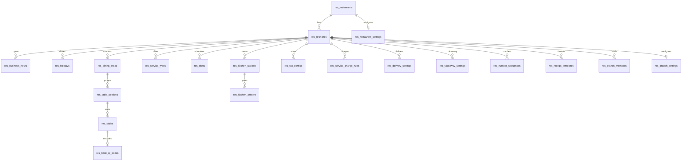
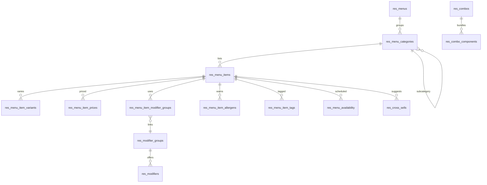
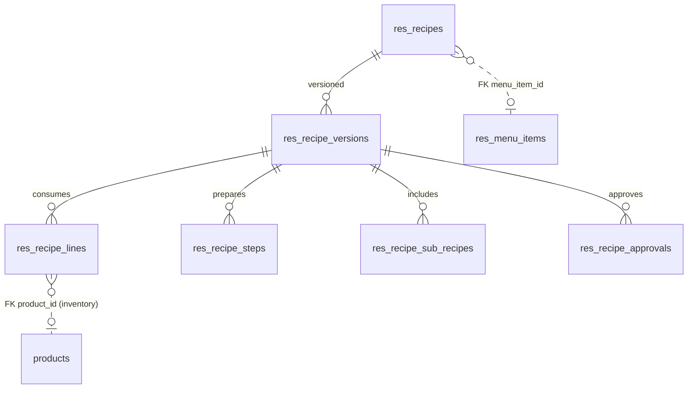
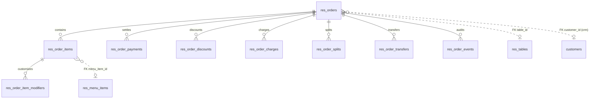
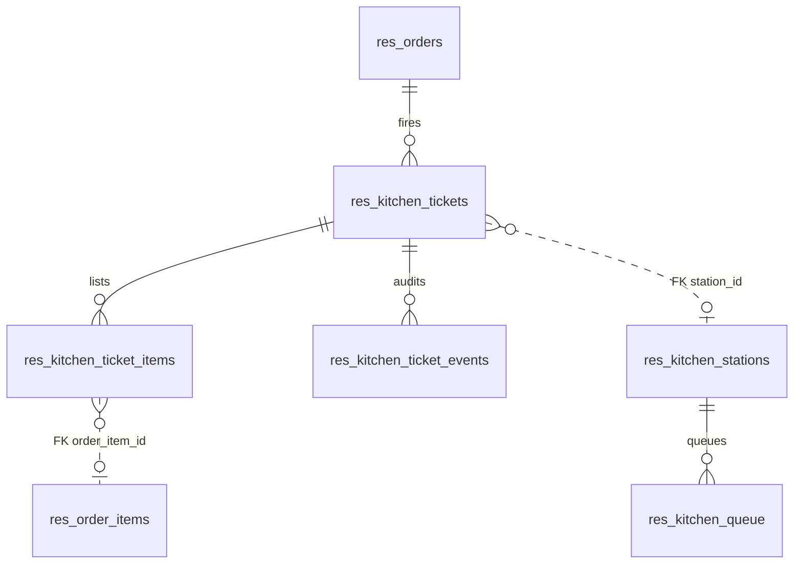
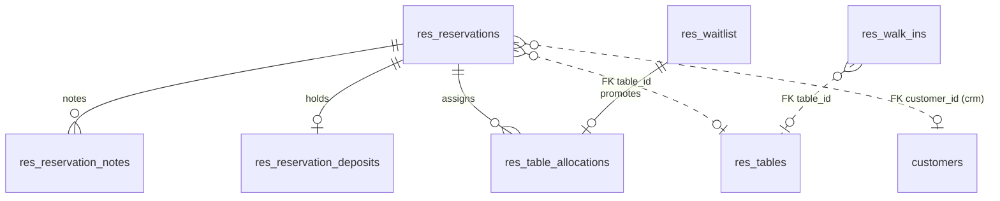
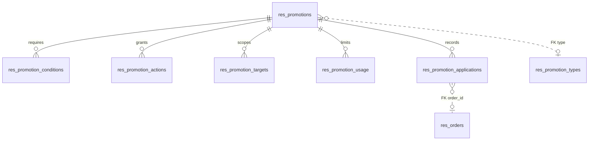
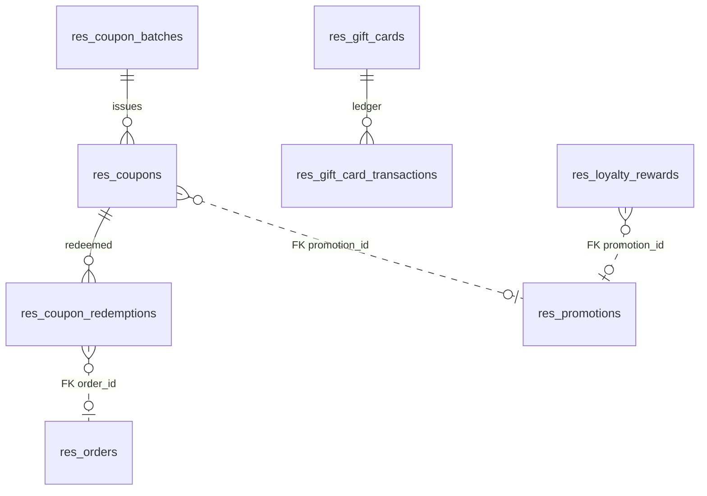
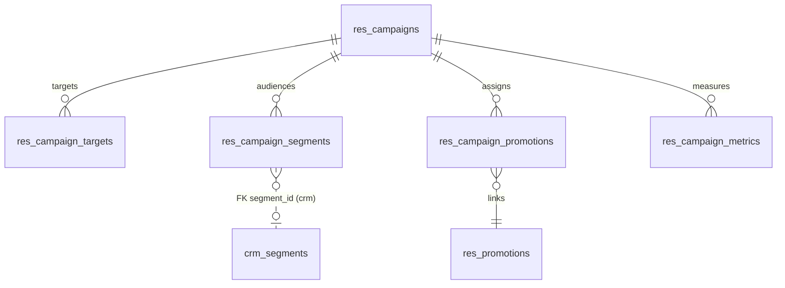
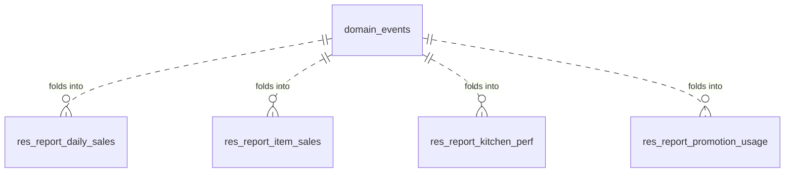

# Entity Relationship Diagrams — Feature 004

Mermaid ERDs per domain. Only intra-module relationships are drawn as crow's-foot lines. Cross-module
references (to `products`, `customers`, `warehouses`, `crm_*`) are **bare scalar UUIDs** with
app-enforced integrity and are shown as annotated `FK` columns, not relationship lines — consistent
with the inventory/CRM convention. Every table also carries `tenant_id` (omitted from diagrams for
readability; it leads every unique/index).

## Master data (Phase 1)

## Menu (Phase 2)

## Recipes (Phase 3)

## Orders (Phase 4)

## Kitchen Display System (Phase 5)

## Reservations (Phase 6)

## Promotions (Phase 7)

## Coupons, Loyalty, Gift cards (Phase 8)

## Campaigns (Phase 9)

## Reporting (Phase 10)

