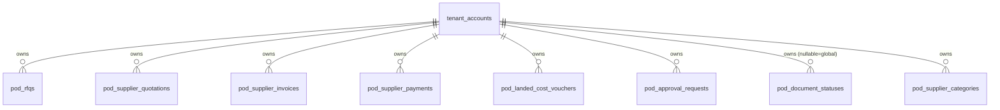
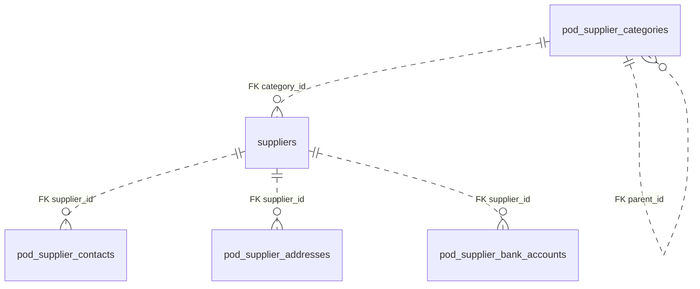
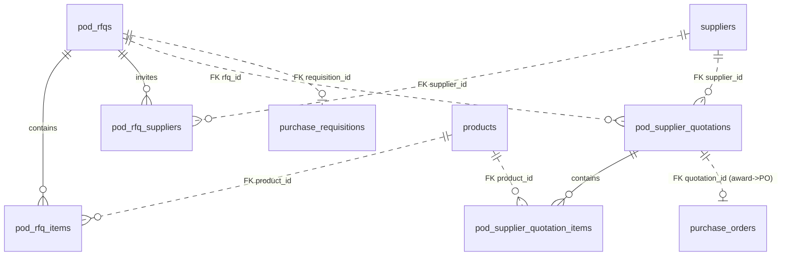
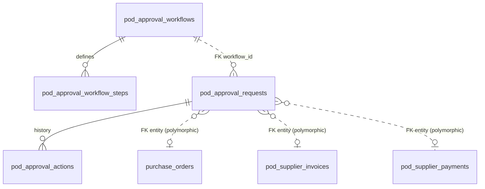
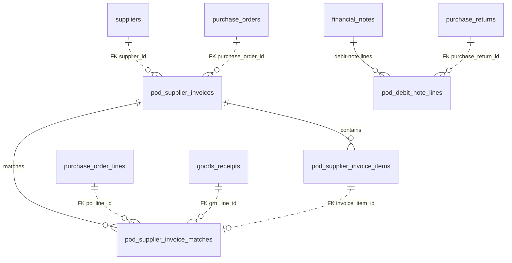
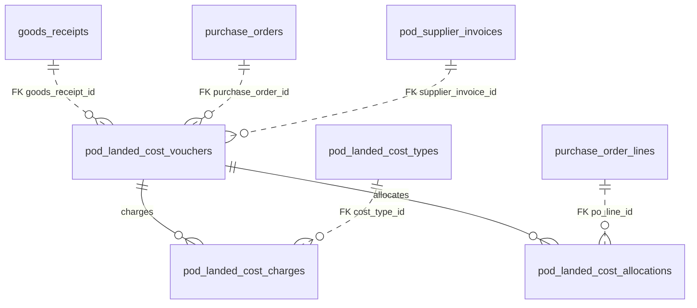
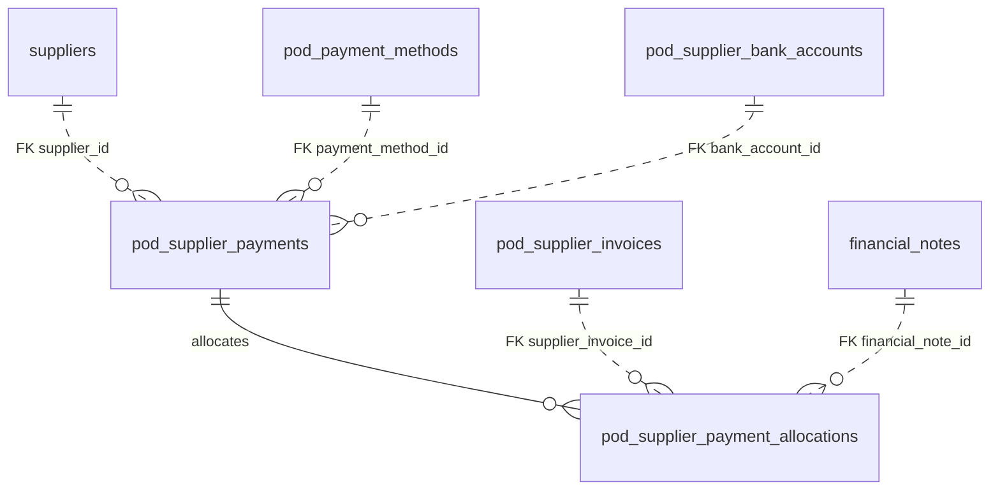
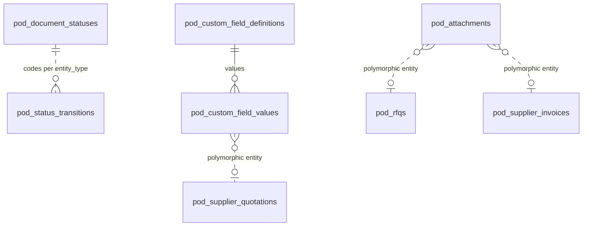
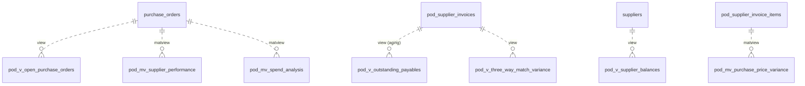

# Entity Relationship Diagrams — Purchase Management (Spec 005)

Mermaid ERDs grouped by logical cluster. Only **intra-module composition** (header → line) and the
**tenant** relationship are drawn as crow's-foot lines, because they are the only real DB foreign
keys. Every other reference — to the Spec-002 spine (`suppliers`, `purchase_orders`,
`goods_receipts`, `financial_notes`, `purchase_returns`, `purchase_requisitions`) and to inventory
core (`products`, `tenant_accounts`, lookups) — is a **bare scalar UUID** with app-enforced
integrity, drawn as a dashed/annotated `FK` link, matching the inventory/CRM convention.

Every `pod_*` table also carries `tenant_id → tenant_accounts` (real FK, cascade); it is shown once
in the overview and omitted elsewhere for readability.

## Tenant scope (applies to every table)

## Supplier CRM

## RFQ / Quotation

## Approval engine (generic)

## Invoicing / AP + 3-way match

## Landed cost

## Payments (AP)

## Cross-cutting (status lookups, attachments, custom fields)

## Reporting projections (views / matviews)

