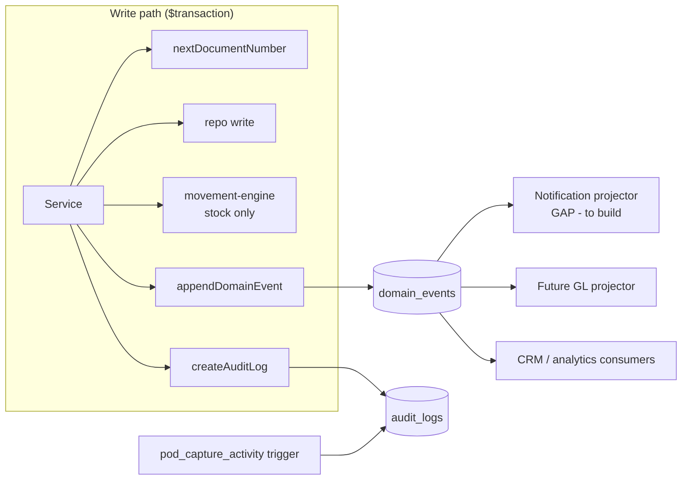

# Integration — Purchase Management (Spec 005)

How the enterprise procurement layer plugs into the existing platform. The design
rule is **reuse, don't duplicate**: Spec 005 adds `pod_` tables and DB objects but
routes all cross-cutting behavior through infrastructure that already ships with
the Spec-002 spine.

| Concern | Reused module | Spec-005 addition |
|---|---|---|
| Inventory / costing | `src/server/inventory/movement-engine.ts`, `costing.ts`, `lot-serial-service.ts` | GRN posting, purchase returns, landed-cost revaluation |
| Numbering | `src/server/inventory/document-number-service.ts` + `document_sequences` | 5 new `DocumentType` enum values |
| Audit | `src/server/repos/audit-log-repo.ts` + `audit_logs` | `pod_capture_activity()` trigger on `pod_` headers |
| Events | `src/server/events/event-outbox.ts` + `domain_events` | new `rfq.* / supplier_*.* / landed_cost.* / purchase_approval.decided` types |
| Guards | `src/server/auth/tenant-guard.ts`, `errors.ts`, `session.ts` | `purchase.*` permission codes |
| State | `src/server/inventory/state-machine.ts` (enum docs) | `pod_document_statuses` / `pod_status_transitions` (lookup docs) |
| Reporting | — | `pod_v_*` views + `pod_mv_*` matviews |
| Notifications | **none exists** | interface described below (gap) |

---

## 1. Inventory

Inventory is written **exclusively** by `movement-engine.postMovement`, called
from a document's post/confirm action inside its `$transaction`. Spec 005 never
posts stock from a trigger (the migration comment at section 5 makes this
explicit) — that would double-post against the service-layer path.

- **Goods receipt** → `postMovement({ movementType: 'PURCHASE_RECEIPT', direction: 'IN', unitCost })`.
  The engine locks `StockBalance`, appends an immutable `InventoryMovement`, runs
  WAC via `applyMovement`, opens a `cost_layer` (FIFO), and enforces the product
  `TrackingPolicy` (LOT needs a `lotId`, SERIAL a `serialId` at qty 1). It returns
  the new `avgUnitCost` / `onHand`.
- **Purchase return** → `postMovement({ movementType: 'PURCHASE_RETURN', direction: 'OUT' })`.
  OUT movements respect the oversell guard (available = onHand − reserved −
  allocated) unless `allowNegative`.
- **Costing (WAC / FIFO)** — IN movements record their cost and open a layer; OUT
  movements consume at WAC. Spec 005 supplies `unitCost` from the PO line / GRN
  line; nothing about the costing math changes.
- **Lots / serials** — receiving lot- or serial-tracked products passes
  `lotId` / `serialId` through to the engine, which advances the serial lifecycle
  (`serialTransition`) and whereabouts.
- **Landed cost updating average cost** — after
  `pod_allocate_landed_cost(voucher_id)` distributes charges to
  `pod_landed_cost_allocations`, the landed-cost **service** applies each per-line
  amount to the product's average cost through the movement/costing engine (a
  cost-only revaluation), keeping the single-writer invariant. The allocation
  *arithmetic* is in the DB; the *inventory effect* is in the service.

PO-line fulfillment counters (`received_qty`, `rejected_qty`, `returned_qty`,
`cancelled_qty`) are maintained by services; `remaining_qty` is a **STORED
generated column** (`ordered − received − rejected − returned − cancelled`) the
app never writes.

## 2. Finance / AP (subledger — no double-entry GL)

Spec 005 implements an **AP subledger**, not a general ledger. There is no
double-entry posting; instead posted documents maintain balances and emit events
a future GL can subscribe to.

- **Supplier invoices → payables.** `pod_supplier_invoices` header totals are
  recomputed from items by the `pod_recompute_invoice_totals()` trigger
  (`grand_total = subtotal + tax + freight − discount − retention − withholding`;
  `outstanding = grand_total − paid`). Posting sets `is_posted` and recognizes the
  payable.
- **Payments reduce balance.** `pod_supplier_payments` +
  `pod_supplier_payment_allocations` apply cash against invoices (or
  `financial_notes`). `pod_recompute_supplier_balance(tenant, supplier)` sets
  `suppliers.current_balance = Σ(posted invoice outstanding) − Σ(unallocated
  advances)`. Advances (`is_advance`, `unallocated_amount > 0`) sit as negative
  balance until allocated.
- **Debit notes** reuse the existing `financial_notes` header; Spec 005 adds
  `pod_debit_note_lines` (with `pod_debit_note_reasons`) for line detail and can
  link a `purchase_return_id`. The header still emits `financial_note.issued`.
- **Aging** is exposed by `pod_v_outstanding_payables` (buckets
  `current / 1_30 / 31_60 / 61_90 / 90_plus` off `due_date`) and
  `pod_v_supplier_balances`.
- **Events for a future GL** — `supplier_invoice.posted`,
  `supplier_payment.posted`, `landed_cost.posted`, `financial_note.issued` carry
  enough (document number, supplier, amounts as strings) for a GL projector to
  build journal entries later without schema change.

## 3. Approval engine (generic `pod_approval_*`)

A reusable engine keyed by `entity_type` + `entity_id`, so any module (not just
purchasing) can route approvals through it.

- `pod_approval_workflows` (amount band `min_amount`/`max_amount` + `entity_type`,
  optional `auto_approve`) → ordered `pod_approval_workflow_steps`
  (`approver_role_code` or `approver_profile_id`, `is_final`, `allow_delegate`,
  `escalate_after_hours`, JSON `condition`).
- A submit opens a `pod_approval_requests` row (`status_code = pending`,
  `current_step_order = 1`); the source doc stores `approval_request_id` and holds
  at `pending_approval`.
- Each decision writes `pod_approval_actions` (`action_code` ∈
  `approve | reject | delegate | escalate | comment`), gated by
  `purchase.approval_action`. Final approval resolves the request and drives the
  source document's own transition.
- The default per-tenant workflow is seeded by `prisma/seed.ts` (not the
  migration — `pod_approval_workflows.tenant_id` is `NOT NULL`).

## 4. Numbering

`nextDocumentNumber(tx, { tenantId, documentType })` (atomic
`INSERT … ON CONFLICT DO UPDATE … RETURNING` on `document_sequences`, run inside
the document transaction) is reused unchanged. Spec 005 adds five
`DocumentType` enum values — `rfq`, `supplier_quotation`, `supplier_invoice`,
`supplier_payment`, `landed_cost` — via additive `ALTER TYPE … ADD VALUE IF NOT
EXISTS`. Each needs a `DEFAULT_PREFIX` entry in `document-number-service.ts`
(e.g. `RFQ`, `SQ`, `SINV`, `SPAY`, `LCV`) when the services land.

## 5. Audit

Two complementary trails, both into `audit_logs`:

- **Service-layer** — services call `createAuditLog(tx, { actionKey, entityType,
  entityId, oldValues, newValues, actorProfileId, correlationId })`, capturing
  actor + intent.
- **DB-layer** — the `pod_capture_activity()` AFTER trigger on the `pod_`
  document headers (RFQ, quotation, invoice, payment, landed-cost voucher) writes
  a row with `action_key = '<table>.<op>'` and full `to_jsonb(OLD/NEW)` snapshots,
  guaranteeing an activity record even for direct SQL / non-service writes.

`pod_bump_version()` (BEFORE UPDATE) increments `version_number` for optimistic
locking; `pod_touch_updated_at()` maintains `updated_at` on satellite/lookup
tables.

## 6. Events (transactional outbox)

`appendDomainEvent(tx, { tenantId, eventType, aggregateType, aggregateId,
payload, correlationId, actorProfileId })` writes to `domain_events` inside the
business transaction — never caught/swallowed (a lost event is a correctness
bug). New typed payloads live in `domain-event-types.ts`
(`DomainEventPayloadMap`). All Decimal fields are serialized to strings by the
emitter.

## 7. Notifications (GAP — no server-side dispatch exists)

There is **no** server-side notification dispatch layer in the codebase today.
Spec 005 needs one for: approval requested / escalated, invoice due / overdue,
RFQ deadline, quotation received. Recommended interface to build (later phase):

```ts
// src/server/notifications/notification-dispatch.ts (to build)
interface NotificationRequest {
  tenantId: string
  channel: 'in_app' | 'email' | 'webhook'
  recipientProfileId?: string | null
  recipientRoleCode?: string | null
  templateKey: string           // e.g. 'purchase.approval_requested'
  entityType: string
  entityId: string
  payload: Record<string, string>
  correlationId?: string | null
}
async function dispatchNotification(tx, req: NotificationRequest): Promise<void>
```

Preferred implementation: a **projector that subscribes to `domain_events`**
(`purchase_approval.decided`, `supplier_invoice.posted`, …) rather than inline
calls, keeping dispatch out of the write path. Until it exists, notification is a
documented gap — no server function should block on it.

## 8. Reporting (views + matviews)

- **Views** (always live): `pod_v_open_purchase_orders`, `pod_v_po_line_status`,
  `pod_v_outstanding_payables` (AP aging), `pod_v_supplier_balances`,
  `pod_v_three_way_match_variance`.
- **Materialized views** (heavy aggregates, `WITH NO DATA` at create, each with a
  unique index for concurrent refresh): `pod_mv_supplier_performance` (lead time,
  on-time %, spend), `pod_mv_spend_analysis` (monthly spend), and
  `pod_mv_purchase_price_variance` (PO cost vs invoice price).
- Refresh via `pod_refresh_reporting_matviews()` (issues
  `REFRESH MATERIALIZED VIEW CONCURRENTLY` for all three) from a scheduled job or
  after posting batches — see `performance.md`.

---

## Event flow (summary)



Emitted events: `rfq.issued`, `rfq.awarded`, `supplier_quotation.submitted`,
`supplier_quotation.approved`, `supplier_invoice.posted`,
`supplier_invoice.matched`, `supplier_payment.posted`, `landed_cost.posted`,
`purchase_approval.decided`. Consumers are decoupled and idempotent; the outbox
guarantees at-least-once delivery atomic with the business write.
