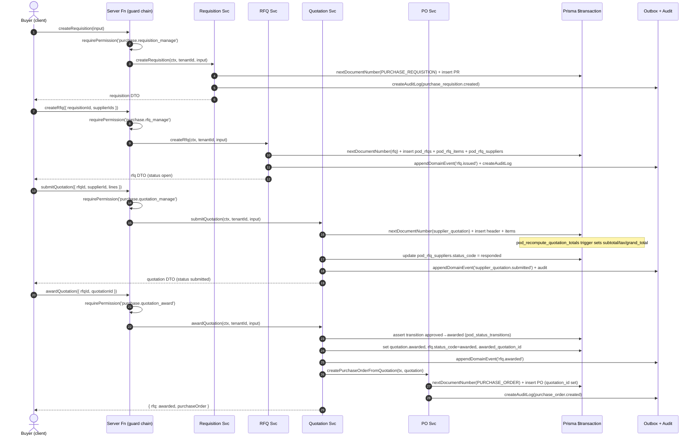
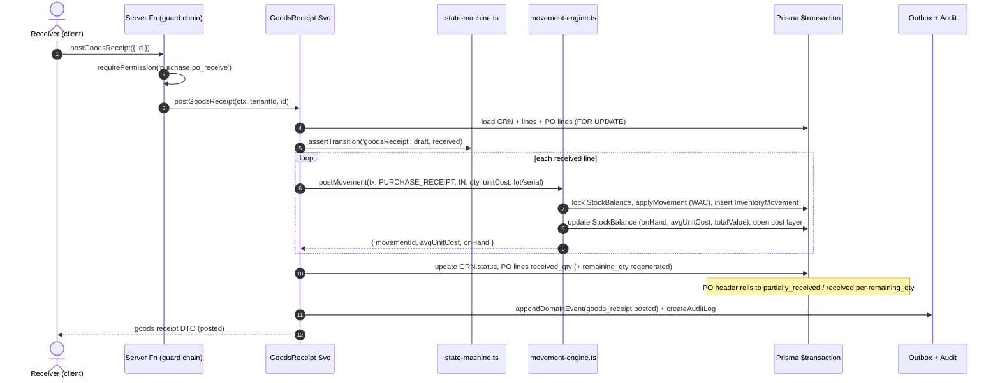
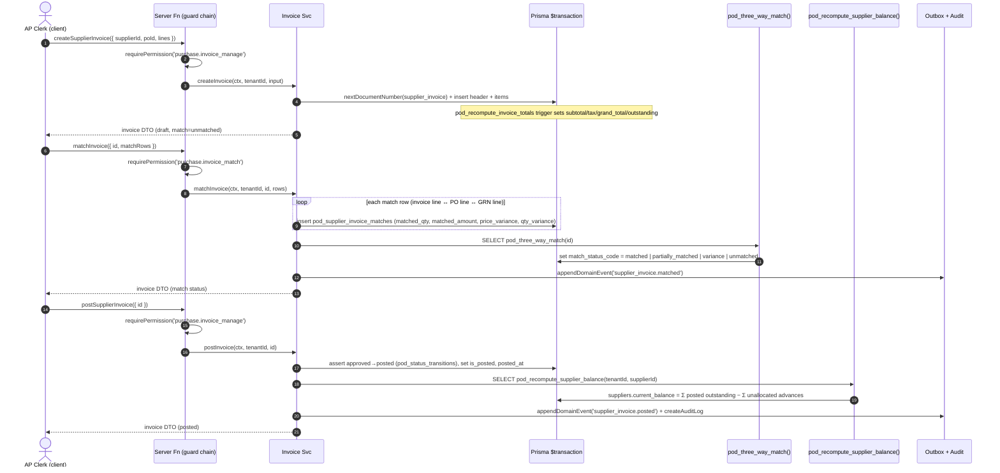
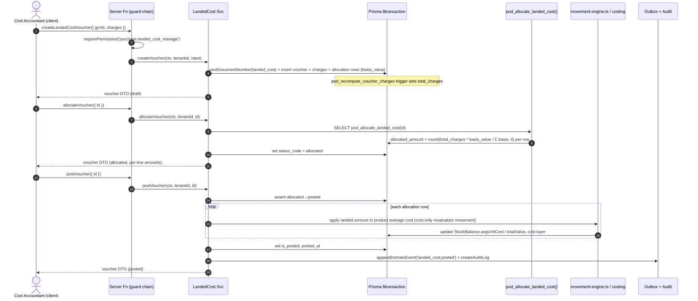

# Sequence Diagrams — Purchase Management (Spec 005)

End-to-end flows through the canonical layering:

```
Client → server function (guard chain) → service ($transaction) → repos + engines → outbox + audit
```

**Guard chain** (every tenant-scoped server function, per
`src/features/purchasing/server-functions.ts` `resolveContext`):

```
getCurrentUserContext({ accessToken, tenantId })
  → requireAuth(context)
  → requireTenantAccess(context, tenantId)
  → requirePermission(context, '<purchase.*>')
```

**Canonical service `$transaction` shape** (all mutating services follow it):

```
nextDocumentNumber(tx)                         # document-number-service.ts
  → assertTransition(...) / pod_status_transitions check   # state guard
  → repo write (header + lines)                # src/server/repos/*
  → postMovement(tx, ...)                       # movement-engine.ts (only where stock moves)
  → appendDomainEvent(tx, ...)                  # event-outbox.ts (atomic outbox)
  → createAuditLog(tx, ...)                      # audit-log-repo.ts
```

Everything runs inside one Prisma `$transaction`; the outbox row and audit row
commit atomically with the business write. Money/quantity values in event
payloads are serialized to strings.

---

## (a) Requisition → RFQ → Quotation → Award → PO



---

## (b) PO → Goods Receipt → inventory movement posting

Stock is posted **only** by `movement-engine.postMovement`, inside the GRN
posting transaction. `MovementType = PURCHASE_RECEIPT` (direction `IN`); a
`PURCHASE_RETURN` posts `OUT`. WAC/FIFO costing and lot/serial enforcement happen
inside the engine.



---

## (c) Supplier Invoice — 3-way match (PO ↔ GRN ↔ Invoice)

`pod_three_way_match(invoice_id)` recomputes `match_status_code` from the
`pod_supplier_invoice_matches` rows (variance tolerance 0.01). Posting recognizes
the payable and recomputes the supplier balance.



---

## (d) Landed-Cost Voucher → allocation → inventory cost update

Allocation math is a DB function; the **inventory average-cost update stays in the
service layer** (calls `movement-engine` / costing) so posting is never
double-applied by a trigger.



---

## (e) Supplier Payment → allocation → supplier balance recompute

```mermaid
sequenceDiagram
    autonumber
    actor U as AP Clerk (client)
    participant SF as Server Fn (guard chain)
    participant PY as Payment Svc
    participant DB as Prisma $transaction
    participant BAL as pod_recompute_supplier_balance()
    participant OUT as Outbox + Audit

    U->>SF: createSupplierPayment({ supplierId, amount, allocations })
    SF->>SF: requirePermission('purchase.payment_manage')
    SF->>PY: createPayment(ctx, tenantId, input)
    PY->>DB: nextDocumentNumber(supplier_payment) + insert pod_supplier_payments
    loop each allocation (→ invoice or financial_note)
        PY->>DB: insert pod_supplier_payment_allocations (allocated_amount)
        PY->>DB: bump invoice.paid_amount, recompute outstanding_amount + payment_status_code
    end
    PY->>DB: set allocated_amount, unallocated_amount (= amount − Σ allocated; advance if > 0)
    PY-->>U: payment DTO (draft)

    U->>SF: postSupplierPayment({ id })
    SF->>SF: requirePermission('purchase.payment_manage')
    SF->>PY: postPayment(ctx, tenantId, id)
    PY->>DB: assert approved→posted, set is_posted, posted_at
    PY->>BAL: SELECT pod_recompute_supplier_balance(tenantId, supplierId)
    BAL->>DB: suppliers.current_balance recomputed
    PY->>OUT: appendDomainEvent('supplier_payment.posted') + createAuditLog
    PY-->>U: payment DTO (posted)
```

---

## (f) Approval routing with escalation

Amount-threshold workflow (`pod_approval_workflows` + `_steps`). The source
document (PO/invoice/payment) holds at its `pending_approval` state until the
final step resolves; each decision writes a `pod_approval_actions` row and emits
`purchase_approval.decided`.

```mermaid
sequenceDiagram
    autonumber
    actor R as Requester (client)
    actor A1 as Approver L1
    actor A2 as Approver L2
    participant SF as Server Fn (guard chain)
    participant AP as Approval Svc
    participant DB as Prisma $transaction
    participant SCH as Scheduler (SLA)
    participant OUT as Outbox + Audit

    R->>SF: submitForApproval(entityType, entityId, amount)
    SF->>AP: openRequest(ctx, tenantId, input)
    AP->>DB: pick pod_approval_workflows by entity_type + amount band
    AP->>DB: insert pod_approval_requests (status=pending, current_step_order=1)
    AP->>DB: link source doc.approval_request_id
    AP-->>R: request DTO (pending, step 1)

    A1->>SF: actOnApproval({ requestId, action: approve })
    SF->>SF: requirePermission('purchase.approval_action')
    SF->>AP: act(ctx, tenantId, requestId, approve)
    AP->>DB: insert pod_approval_actions (step 1, approve)
    AP->>DB: advance current_step_order = 2 (step 1 not is_final)
    AP->>OUT: appendDomainEvent('purchase_approval.decided', status=pending)

    Note over SCH,DB: step 2 escalate_after_hours elapses with no action
    SCH->>AP: escalate(requestId)
    AP->>DB: assert pending→escalated, insert action (escalate)
    AP->>OUT: appendDomainEvent('purchase_approval.decided', status=escalated)

    A2->>SF: actOnApproval({ requestId, action: approve })
    SF->>AP: act(ctx, tenantId, requestId, approve)
    AP->>DB: insert action (step 2, approve); step2.is_final = true
    AP->>DB: set request.status=approved, completed_at
    AP->>DB: transition source doc pending_approval → approved
    AP->>OUT: appendDomainEvent('purchase_approval.decided', status=approved) + audit
    AP-->>A2: request DTO (approved)
```
