# State Diagrams — Purchase Management (Spec 005)

Lifecycle diagrams for every procurement document. Two status regimes coexist:

- **Spec-002 spine documents** (`purchase_requisitions`, `purchase_orders`,
  `goods_receipts`, `purchase_returns`) keep their **native Postgres enums** and
  the code-defined guard in `src/server/inventory/state-machine.ts`
  (`assertTransition(machine, from, to)`).
- **New `pod_` documents** (RFQ, supplier quotation, supplier invoice, supplier
  payment, landed-cost voucher, approval request) use **lookup-table statuses**:
  `pod_document_statuses` (per `entity_type`) enumerates the states and
  `pod_status_transitions` enumerates the legal `from_code → to_code` edges. Each
  diagram below mirrors exactly the rows seeded in the migration
  (`20260717090000_purchase_management_enterprise_v1`).

A `pod_` status is customizable per tenant: a `NULL`-tenant row is the global
default; a tenant may insert its own `entity_type`-scoped rows to extend a
lifecycle without a code change. `requires_permission` on a transition row lets
admins gate an edge (e.g. only `purchase.quotation_award` may award).

---

## RFQ — `entity_type = 'rfq'` (lookup-table)

Initial: `open`. Terminal: `expired`, `cancelled`. `awarded` has no outgoing
edge (effectively final; the RFQ is closed once a quotation is awarded).

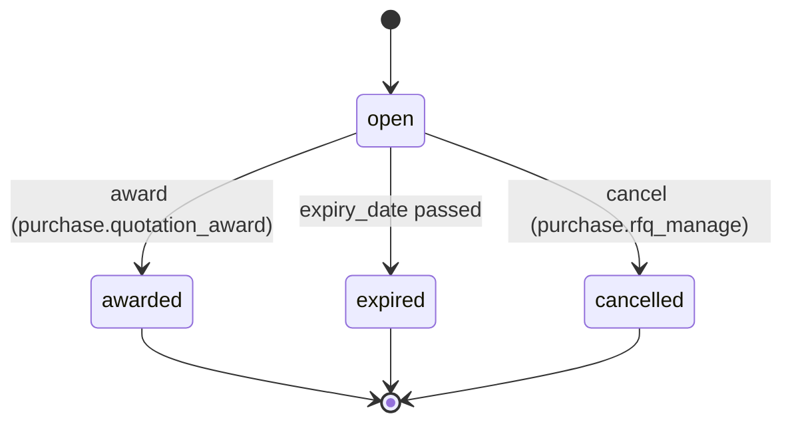

Per-supplier participation (`pod_rfq_suppliers.status_code`) tracks the invite
fan-out independently of the RFQ header: `invited → responded` (declined is
modelled by leaving `responded_at` null and closing the RFQ).

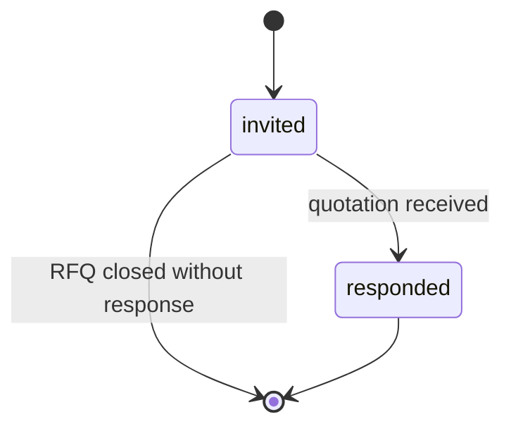

---

## Supplier Quotation — `entity_type = 'supplier_quotation'` (lookup-table)

Initial: `draft`. Terminal: `rejected`, `expired`, `cancelled`. `awarded` is the
success sink (a PO is raised from it; `purchase_orders.quotation_id` back-links).

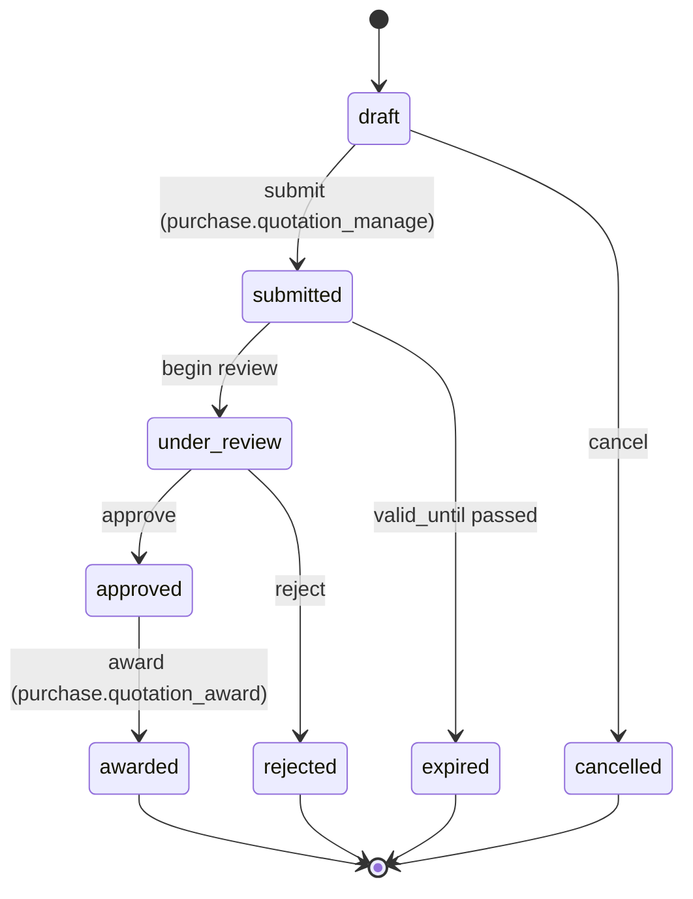

---

## Purchase Order — enum lifecycle (`state-machine.ts` key `purchaseOrder`)

Native enum. Server functions call `assertTransition('purchaseOrder', from, to)`
before persisting. `partially_received` is re-entrant (multiple partial GRNs).
Terminal: `closed`, `cancelled`, `rejected`.

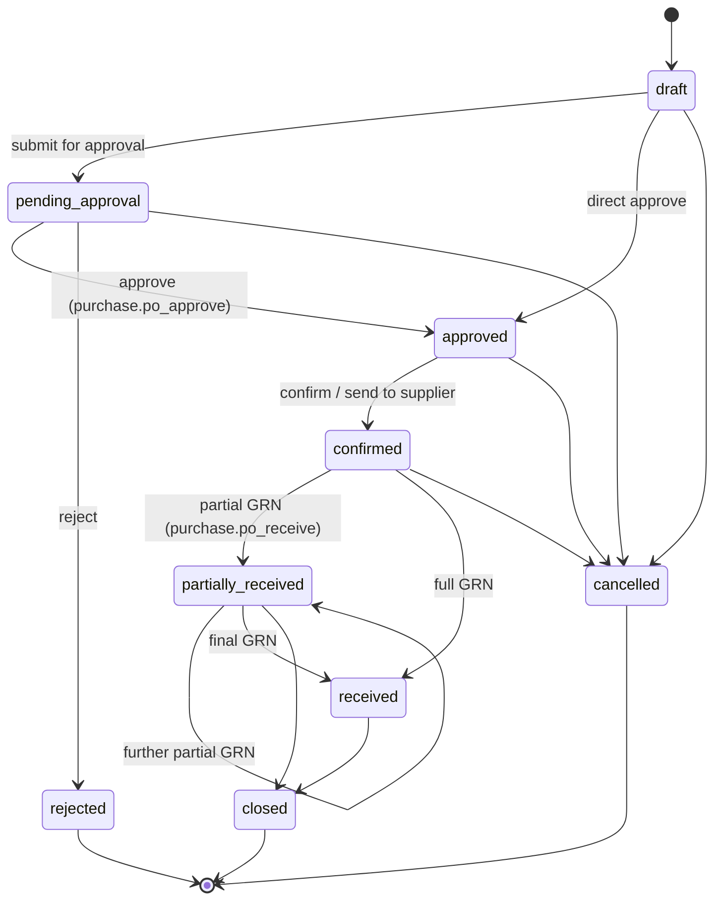

Approval routing is externalized: when the amount exceeds an
`pod_approval_workflows` threshold the PO holds at `pending_approval` and a
`pod_approval_requests` row drives the multi-step decision (see the Approval
Request diagram). `purchase_orders.approval_request_id` links the two.

---

## Goods Receipt — enum lifecycle (`state-machine.ts` key `goodsReceipt`)

Native enum. Inventory is posted by `movement-engine.ts` on the transition into a
stock-affecting state (`received`/`completed`) — never by a DB trigger. Terminal:
`completed`, `rejected`. `goods_receipts.inspection_status_code` (nullable text)
carries the QC outcome parallel to the header status.

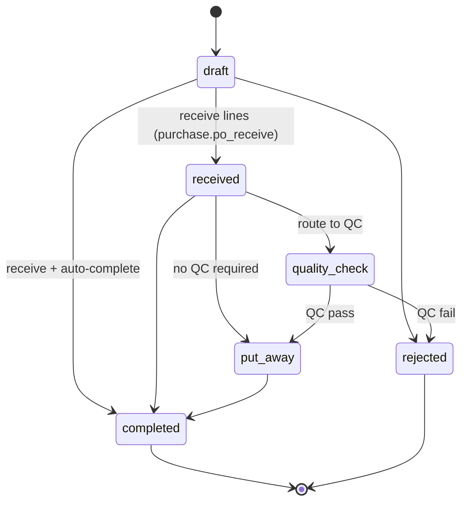

---

## Supplier Invoice — `entity_type = 'supplier_invoice'` (lookup-table)

Header `status_code` is the workflow state; **two orthogonal sub-statuses** ride
alongside it and are recomputed by DB functions, not by the header transition:

- `match_status_code` ∈ `unmatched | partially_matched | matched | variance` —
  set by `pod_three_way_match(invoice_id)` from `pod_supplier_invoice_matches`.
- `payment_status_code` ∈ `unpaid | partially_paid | paid` — advanced as
  `pod_supplier_payment_allocations` are applied and `paid_amount`/
  `outstanding_amount` recomputed.

Header lifecycle — Initial: `draft`. Terminal: `cancelled`. `posted` is the AP
sink (subledger balance recognized; `pod_recompute_supplier_balance` fires on
posted invoices).

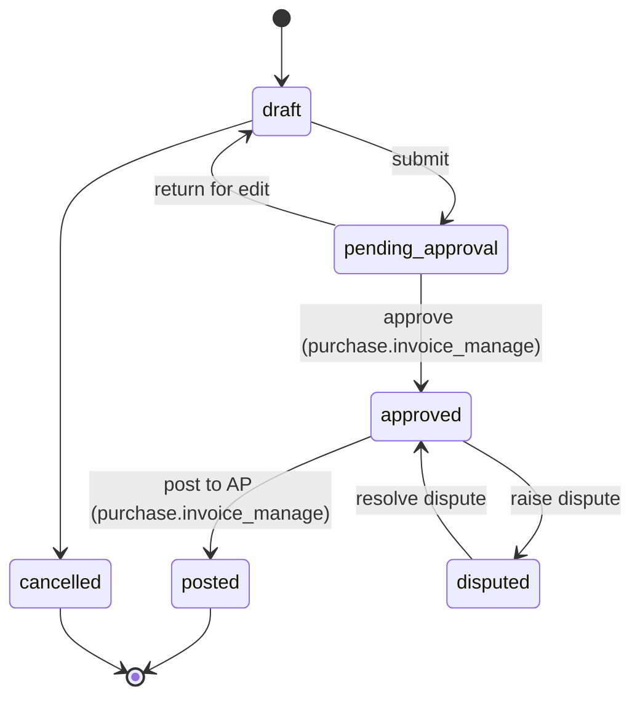

Match sub-status (independent of header state, driven by `pod_three_way_match`):

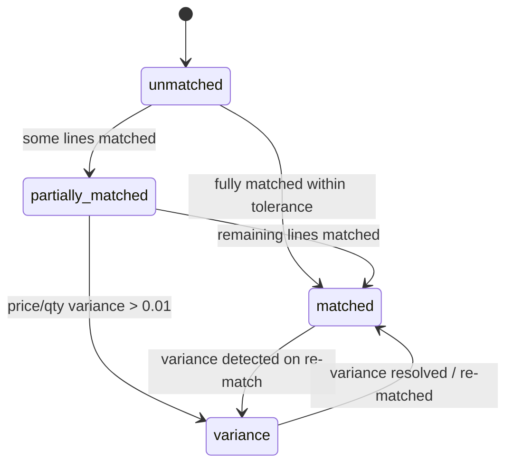

Payment sub-status (independent of header state, driven by payment allocations):

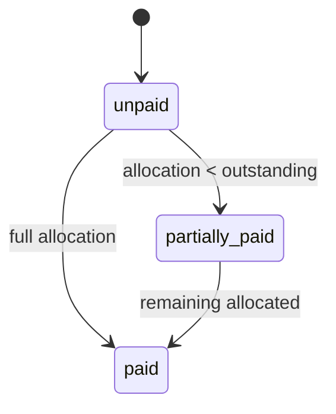

---

## Supplier Payment — `entity_type = 'supplier_payment'` (lookup-table)

Initial: `draft`. Terminal: `cancelled`. `posted` reduces supplier balance via
`pod_recompute_supplier_balance` and moves `unallocated_amount` (advances) onto
the subledger.

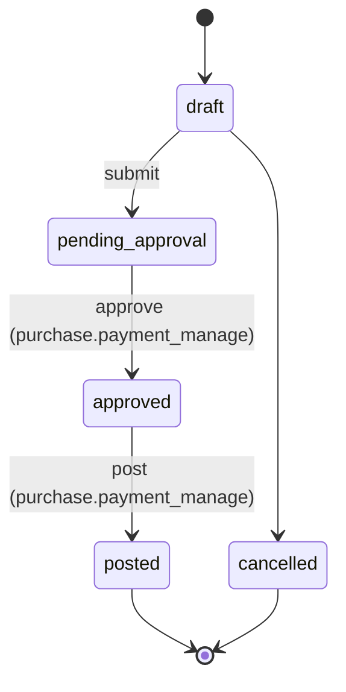

---

## Landed-Cost Voucher — `entity_type = 'landed_cost'` (lookup-table)

Initial: `draft`. Terminal: `cancelled`. `allocated` runs
`pod_allocate_landed_cost(voucher_id)` (distributes `total_charges` across
`pod_landed_cost_allocations` by basis); `posted` applies the per-line landed
cost to inventory average cost at the **service layer** (`movement-engine.ts` /
costing), never a trigger.

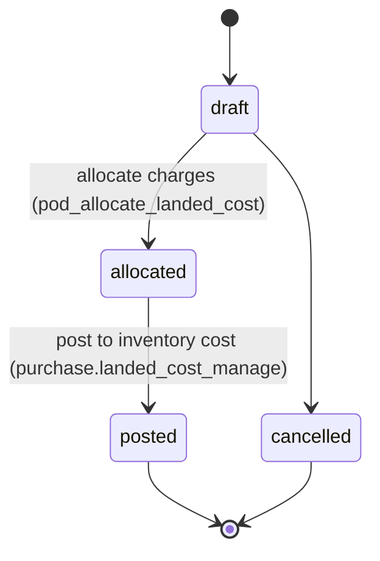

---

## Approval Request — `entity_type = 'approval_request'` (lookup-table)

Generic engine reused by any gated entity (`entity_type` + `entity_id`). Initial:
`pending`. Terminal: `approved`, `rejected`, `cancelled`. `escalated` is a
non-terminal holding state entered when a step's `escalate_after_hours` elapses.

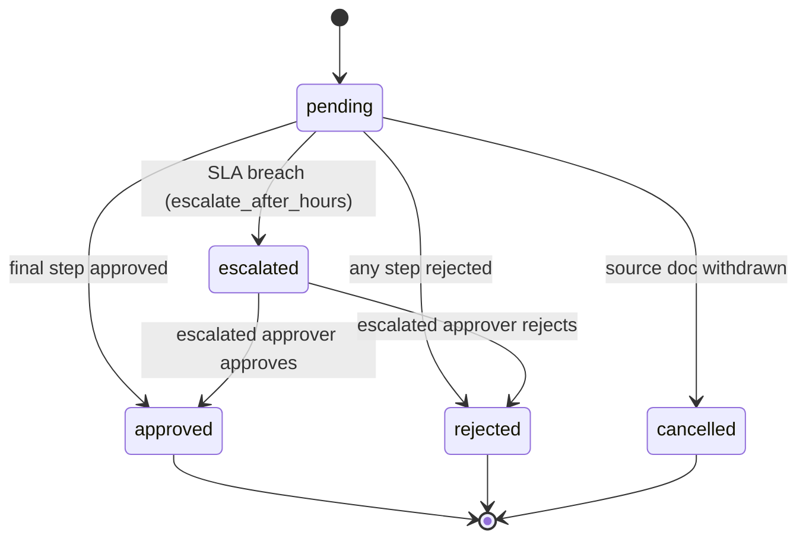

Multi-step advance (within `pending`) is tracked by
`pod_approval_requests.current_step_order` against `pod_approval_workflow_steps`;
each decision writes a `pod_approval_actions` row (`action_code` ∈
`approve | reject | delegate | escalate | comment`). When the final step
(`is_final = true`) approves, the request resolves and the source document's own
transition fires (PO → `approved`, invoice → `approved`, …).
