# ERD — Feature 006 (Enterprise Financial Management)

Mermaid ERDs grouped by domain cluster. As in the 005 ERDs, only **intra-module composition**
(header → line), **intra-finance master references** (account/type/period/tax code/…), and the
**tenant** relationship are real DB foreign keys — drawn as solid crow's-foot lines. Every
cross-module reference (`customers`, `suppliers`, `pod_supplier_invoices`, `pos_sales`,
`profiles`, source docs, …) is a **bare scalar UUID** with app-enforced integrity, drawn as a
dashed `||..o{` link. Entities that belong to another domain (or another module) appear without
attributes.

Every `fin_*` table carries `tenant_id → tenant_accounts` (real FK, cascade); it is shown once
below and omitted elsewhere for readability.

## Tenant scope (applies to every table)

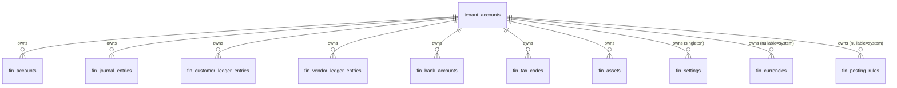

## Domain 1 — GL / Chart of Accounts

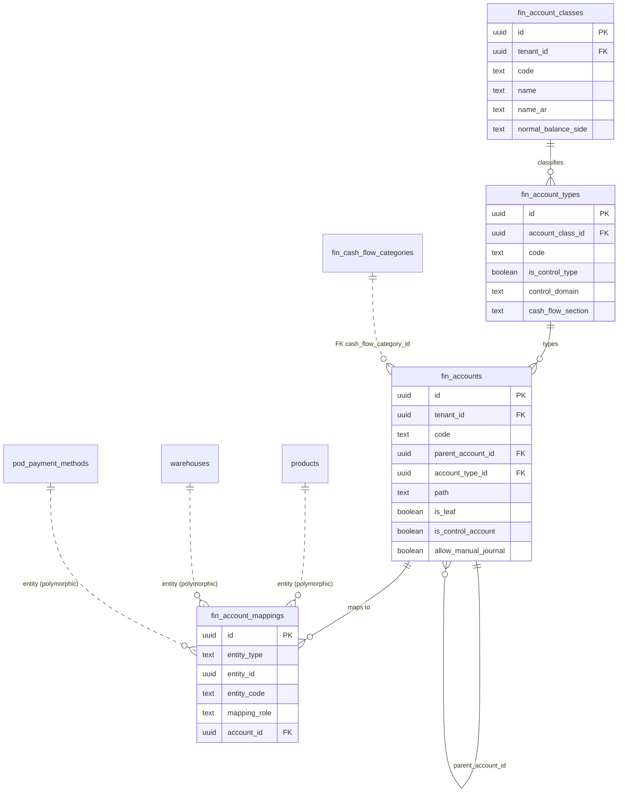

## Domain 2 — Fiscal calendar

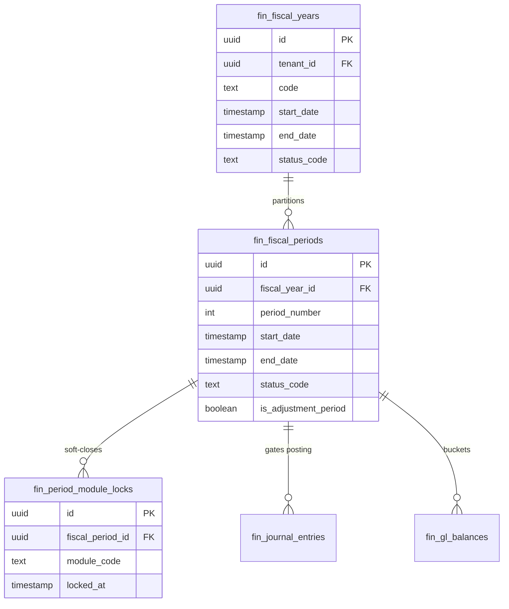

## Domain 3 — Journals + GL balances

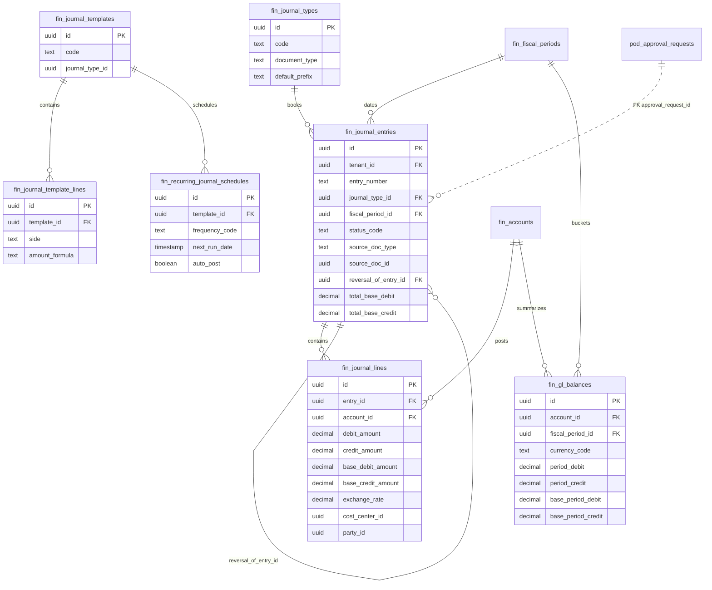

## Domain 4 — Accounts Receivable

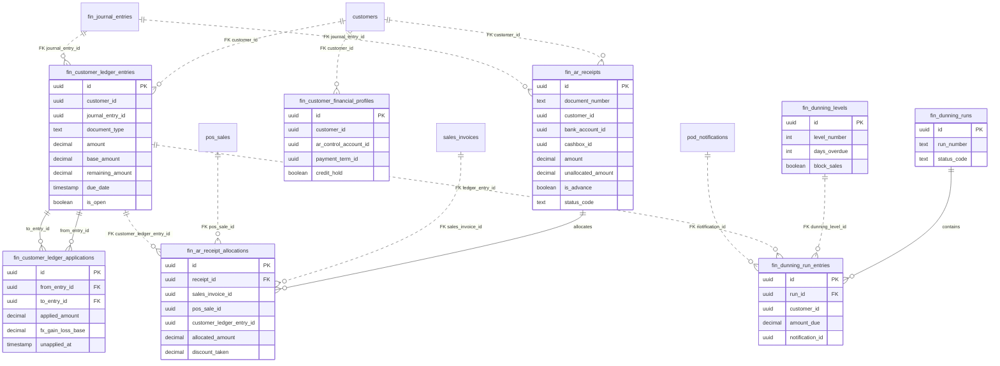

## Domain 5 — Accounts Payable

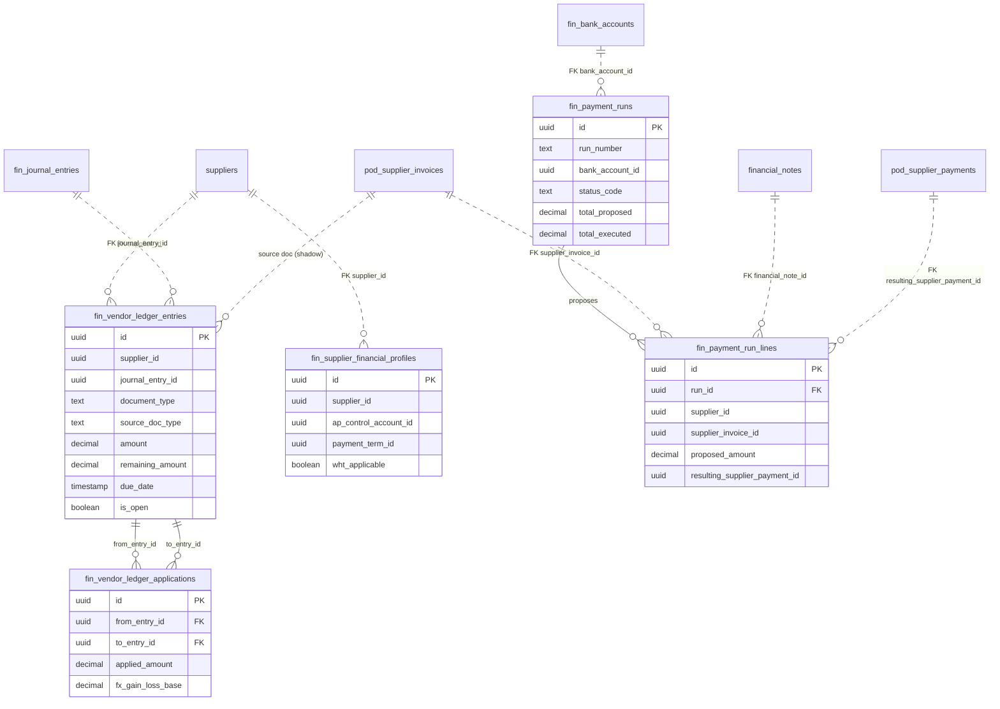

## Domain 6 — Cash management

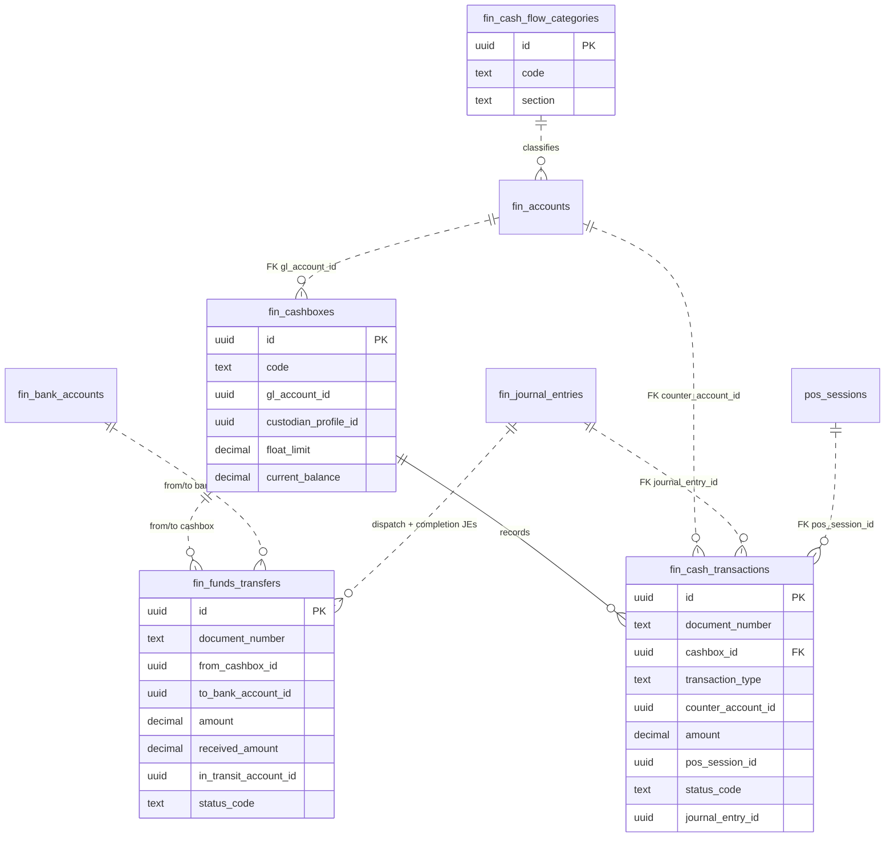

## Domain 7 — Banking + reconciliation

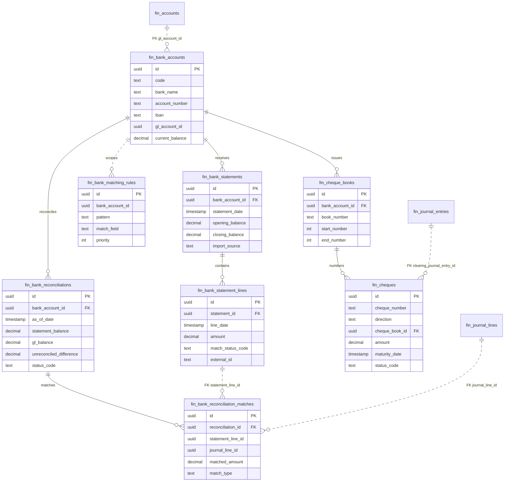

## Domain 8 — Tax accounting

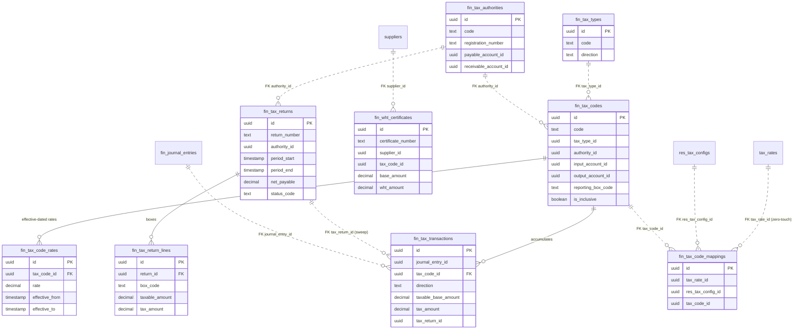

## Domain 9 — Multi-currency

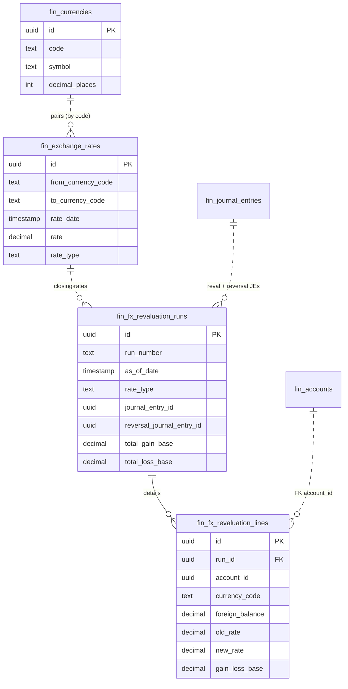

## Domain 10 — Cost dimensions

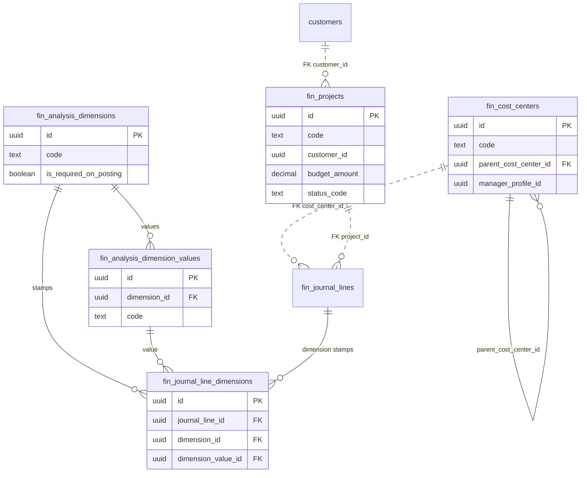

## Domain 11 — Budgets

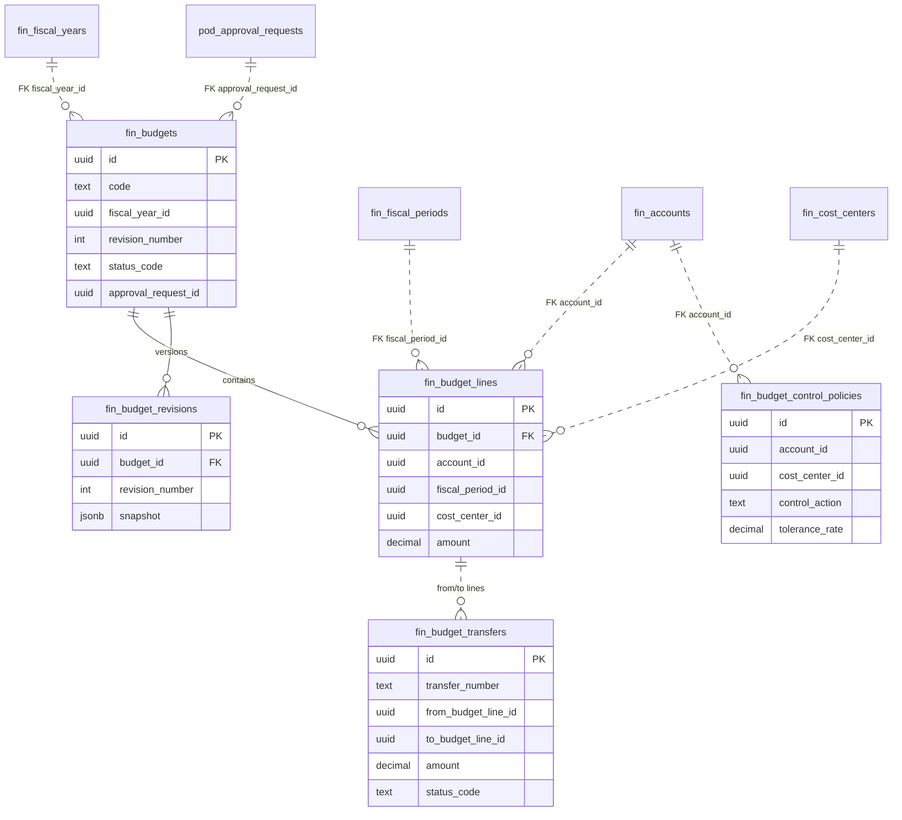

## Domain 12 — Fixed assets

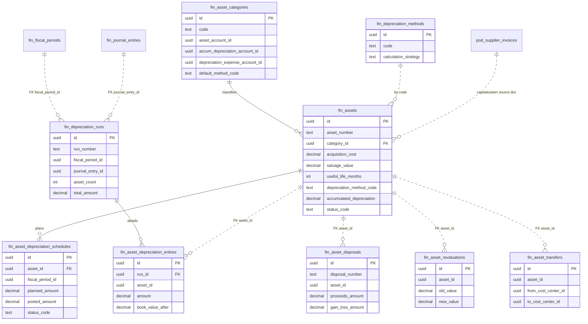

## Domain 13 — Closing, opening balances, allocations

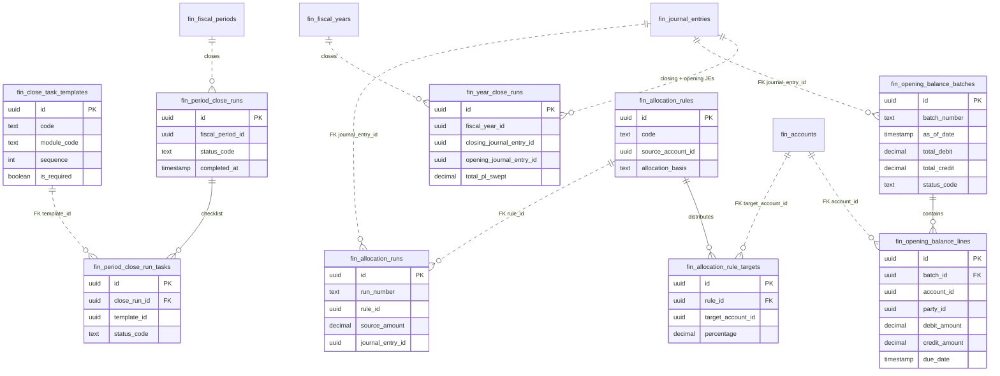

## Domain 14 — Settings + posting engine

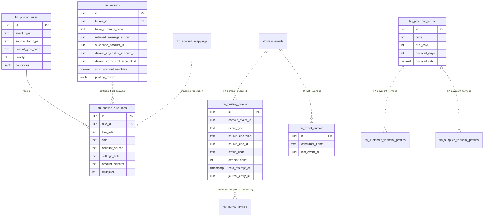

## Cross-domain integration

`fin_journal_entries` is the hub every module posts into: operational documents flow in through
the outbox → cursor → queue pipeline (async) or post directly in-transaction (fin-native docs);
each posted entry fans out to lines, GL balances, subledgers, and tax transactions.

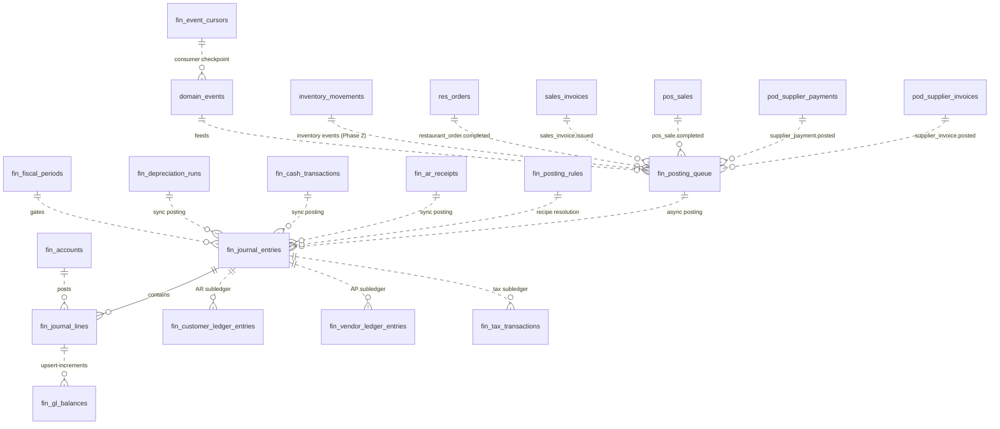
