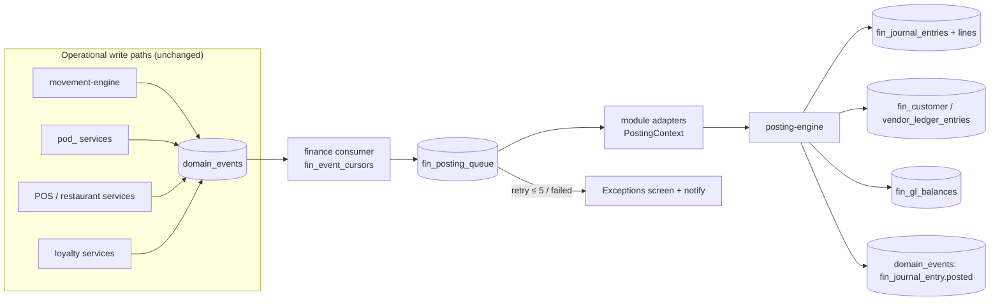

# Integration — Financial Management (Spec 006)

How the `fin_` accounting engine plugs into every existing module. The design rule
is **fin_ observes, never mutates**: operational documents (inventory movements,
`pod_` AP docs, POS sales, restaurant orders, CRM ledgers) remain
operational-authoritative; the finance layer consumes their `domain_events`,
translates them through **posting rules + account mappings** into balanced
journal entries, and maintains GL balances and AR/AP subledgers as shadows.
Zero breaking changes to existing modules.

| Concern | Reused module | Spec-006 addition |
|---|---|---|
| Events | `src/server/events/event-outbox.ts` + `domain_events` | finance consumer (`fin_event_cursors`) + `fin_posting_queue` |
| Numbering | `document-number-service.ts` + `document_sequences` | 14 new `DocumentType` values (`journal_entry`, `ar_receipt`, `payment_run`, …) |
| Approvals | `pod_approval_*` polymorphic engine | `approvalRequestId` on payment runs, budgets, opening-balance batches, manual JEs above threshold |
| Notifications | `notify(tx, …)` (`src/server/notifications/notification-service.ts`) + `PodNotification` | posting failures, period-close tasks, dunning, cheque bounce |
| Attachments / custom fields | `PodAttachment`, `PodCustomFieldDefinition/Value` | fin entity types registered (journal_entry, ar_receipt, asset, …) |
| Statuses | `PodDocumentStatus` / `PodStatusTransition` registry | fin entity-type rows seeded (no new Prisma enums) |
| Audit | `createAuditLog` + `audit_logs` | every post/reverse/close writes an audit row in-tx |
| Tax masters | existing `tax_rates`, `res_tax_configs` | `fin_tax_code_mappings` links them to `fin_tax_codes` — zero-touch |

---

## 0. Posting architecture (recap)

Two paths into the ledger (see `plan.md` / `sequence-diagrams.md`):

- **Sync (in-tx)** — fin-native documents (manual JEs, AR receipts, cash
  transactions, depreciation runs, FX revaluations, allocations, closing
  entries). The service calls `posting-engine.postJournalEntry(tx, …)` inside its
  own `$transaction`; failure rolls back the document.
- **Async (queue)** — operational documents. The source module keeps emitting the
  events it already emits (`supplier_invoice.posted`, `pos_sale` completion,
  inventory movement events, …). The finance consumer advances
  `fin_event_cursors`, enqueues `fin_posting_queue` rows (dedupe unique on
  `(tenant_id, source_doc_type, source_doc_id, source_event_type)`), and a
  processor drains the queue: adapter builds a `PostingContext` → posting engine
  posts JE + subledger rows in one tx. Retry ≤ 5 with exponential backoff;
  exhausted rows surface in the **posting exceptions screen** + `notify(...)`.
  **Operational flows never block on accounting.**

Idempotency is structural: partial unique index on
`fin_journal_entries (tenant_id, source_doc_type, source_doc_id, source_event_type)
WHERE status_code = 'posted' AND reversal_of_entry_id IS NULL` — a duplicate
drain attempt fails with `DUPLICATE_SOURCE` and the queue row is marked `skipped`.

**Account resolution order** (every adapter): posting-rule fixed account →
`fin_account_mappings` walk (product → category incl. parents → warehouse →
branch → payment method → party group) → `fin_settings` named default →
`strictAccountResolution ? throw ACCOUNT_UNRESOLVED : post to suspense + notify`.
Async adapters run non-strict by default so a missing mapping produces a
suspense posting, not a stuck queue.

---

## 1. Inventory

**Events consumed** (async queue): movement-level events for
`inventory_movements` rows, keyed by `MovementType` + `sourceDocType`. Amount
source is always the movement's own costing output — `totalCost`
(`qtyInBaseUom × unitCost`, WAC/FIFO applied by `movement-engine.ts`) — never a
re-derived price. The adapter groups movements by source document +
correlation id so one GRN / one adjustment posts one JE with per-line detail
(`warehouseId` → branch/warehouse dimension on `fin_journal_lines`).

| Operation (MovementType) | Debit | Credit | Amount source | Notes |
|---|---|---|---|---|
| Inventory receipt (`PURCHASE_RECEIPT`) | Inventory | GRNI (goods received not invoiced) | `InventoryMovement.totalCost` | GRNI cleared later by supplier invoice (§2) |
| Inventory issue / sale (`SALE`) | COGS | Inventory | movement `totalCost` (WAC at issue) | delivery/POS-driven; see §3/§4 |
| Stock adjustment + (`ADJUSTMENT_INC`, `CYCLE_COUNT_INC`) | Inventory | Inventory adjustment gain | movement `totalCost` | gain account via mapping role `inventory_adjustment_gain` |
| Stock adjustment − (`ADJUSTMENT_DEC`, `DAMAGE`, `EXPIRED`, `LOST`, `CYCLE_COUNT_DEC`) | Inventory adjustment loss (or damage/expiry expense) | Inventory | movement `totalCost` | per-reason account override via mapping on adjustment reason |
| Stock transfer out (`TRANSFER_OUT`) | Goods in transit | Inventory (source warehouse) | movement `totalCost` | in-transit account per source/target branch mapping |
| Stock transfer in (`TRANSFER_IN`) | Inventory (target warehouse) | Goods in transit | movement `totalCost` | same-branch transfers may net to a single warehouse-dimension JE |
| Inventory count variance | Inventory / variance account | variance account / Inventory | count posting emits `CYCLE_COUNT_INC/DEC` movements | posted via the adjustment rows above — no separate rule |
| Manufacturing consumption (`PRODUCTION_CONSUMPTION`) | WIP (work in progress) | Inventory | movement `totalCost` of consumed components | WIP account via mapping role `wip` (production order dim) |
| Manufacturing completion (`PRODUCTION_OUTPUT`) | Inventory (finished goods) | WIP | output movement `totalCost` | variance between WIP balance and output cost → production variance account |
| Revaluation / landed cost (`REVALUATION`, `LANDED_COST_ADJUSTMENT`) | Inventory | Landed-cost accrual / AP | cost delta applied by costing service | see §2 landed cost |

`OPENING_BALANCE` movements are **not** posted by the adapter — inventory opening
value enters through `fin_opening_balance_batches` (D13) to avoid double-count.
`RESERVATION*` movements have no accounting effect (no value change).

## 2. Purchasing (pod_) — PO → GRN → Invoice → Landed cost → Payment → Return

**Events consumed** (async): `supplier_invoice.posted`, `supplier_payment.posted`,
`landed_cost.posted`, `financial_note.issued` (debit notes) — all already
emitted by Spec-005 services with string-serialized amounts. GRN/return stock
effects arrive via the inventory movement events (§1); the purchasing adapter
never double-posts them.

The AP subledger (`fin_vendor_ledger_entries` + `fin_vendor_ledger_applications`)
is written **in the same tx as the JE**. `pod_supplier_invoices.outstandingAmount`
/ `suppliers.currentBalance` (maintained by `pod_recompute_supplier_balance`)
remain the operational truth; the fin subledger is the accounting shadow that
carries open-item state (`remainingAmount`, `dueDate`) for aging, statements and
payment proposal.

| Step | Debit | Credit | Amount source | Notes |
|---|---|---|---|---|
| Purchase order approved | — | — | — | **no posting**; commitment/encumbrance reporting only (budget check optional, D11) |
| Goods receipt posted | Inventory | GRNI | `PURCHASE_RECEIPT` movements' `totalCost` (§1) | posted by the inventory adapter, tagged `sourceDocType = goods_receipt` |
| Supplier invoice posted | GRNI (matched qty × PO cost) + Input VAT (`taxTotal`) + price variance Dr/Cr | AP control | `PodSupplierInvoice.grandTotal`, `taxTotal`; matched cost from `pod_supplier_invoice_matches` | variance = invoice price − GRN/PO cost → purchase price variance account; non-stock lines Dr expense via product/category mapping; `withholdingTaxAmount` Cr WHT payable; vendor ledger entry `invoice` created (`remainingAmount = grandTotal`) |
| Landed cost posted | Inventory (per allocation) | AP control (chargeable supplier invoice) or landed-cost accrual | `pod_landed_cost_allocations.allocatedAmount` | inventory side already revalued by costing service; if goods already issued, Dr COGS for the depleted share |
| Supplier payment posted | AP control | Bank / cash (per `paymentMethodId` / `bankAccountId` mapping) | `PodSupplierPayment.amount` | realized FX gain/loss on rate difference between invoice `exchangeRate` and payment `exchangeRate` (Dr loss / Cr gain); settlement discount taken → Cr discount received; vendor ledger `payment` entry + `fin_vendor_ledger_applications` per allocation |
| Advance payment (`isAdvance`) | Supplier advances (prepayment) | Bank / cash | `amount` | reclassed to AP control when later allocated |
| Purchase return posted | GRNI (or AP via debit note) | Inventory | `PURCHASE_RETURN` movements' `totalCost` | mirror of receipt |
| Debit note issued (`financial_note.issued`, `noteType = DEBIT`) | AP control | GRNI / expense / Input VAT reversal | `FinancialNote` totals + `pod_debit_note_lines` | vendor ledger `debit_note` entry reduces open items |

**Payment runs** (`fin_payment_runs`, Phase 3): propose open vendor ledger items
by `dueDate`, route through `pod_approval_*`, then **generate
`PodSupplierPayment` rows** on execute — so the payment itself flows through the
existing Spec-005 posting path above.

## 3. Sales — Quotation → Sales Order → Delivery → Invoice → Receipt → Return

**Events consumed** (async): sales invoice posted, POS sale completed (§4),
sales return posted, `financial_note.issued` (`noteType = CREDIT`), plus the
`SALE` / `SALES_RETURN` inventory movements (§1). AR subledger
(`fin_customer_ledger_entries` / `fin_customer_ledger_applications`) mirrors the
AP pattern; `fin_ar_receipts` (+ allocations targeting
`sales_invoices` / `pos_sales` / `financial_notes`) is the **fin-native** cash
application document (sync posting).

| Step | Debit | Credit | Amount source | Notes |
|---|---|---|---|---|
| Quotation / sales order | — | — | — | no posting; SO may reserve stock (`RESERVATION` — no value effect) |
| Delivery / shipment | COGS | Inventory | `SALE` movements' `totalCost` (WAC) | posted by inventory adapter, `sourceDocType = sales_order` |
| Sales invoice posted | AR control | Revenue (net `subtotal − discountTotal`) + Output VAT (`taxTotal`) | `SalesInvoice.grandTotal / taxTotal` | revenue account via product/category mapping (line-level split); customer ledger `invoice` entry, `remainingAmount = grandTotal`, `dueDate` |
| Customer receipt (`fin_ar_receipts`, sync) | Cash / bank (per payment-method mapping) | AR control | receipt amount | `fin_ar_receipt_allocations` write `fin_customer_ledger_applications`; under/over-payment stays open / posts to customer advances; realized FX gain/loss on rate delta |
| Sales return received | Inventory | COGS | `SALES_RETURN` movements at `costAtReturn` | COGS reversal at original sale cost (no margin leak) |
| Credit note issued (`financial_note.issued`) | Revenue (contra) + Output VAT reversal | AR control | `FinancialNote` totals | customer ledger `credit_note` entry; refund by cash instead → Cr Cash |

## 4. Restaurant / POS settlement

**Events consumed** (async): POS sale completed (`PosSale` + `PosPayment` rows),
POS session closed (`PosSession`), restaurant order completed (`ResOrder` +
`ResOrderPayment` / `ResOrderCharge` / `ResOrderDiscount`), gift-card issuance /
redemption, loyalty accrual / redemption (via `crm_loyalty_ledger` events).
POS/restaurant sales are treated as **cash-basis invoices**: revenue and
settlement post in one JE per sale (no AR open item unless
`method = CREDIT` — then an AR customer ledger entry is created instead).

One JE per completed sale; **split bills aggregate**: all
`ResOrderPayment` rows of an order (across `splitId`s) post into the same JE.

| Operation | Debit | Credit | Amount source | Notes |
|---|---|---|---|---|
| Sale — revenue side | (settlement side below) | Revenue (net) + Output VAT | `grandTotal`, `taxTotal`, line data | revenue by menu-item/product/category mapping; branch dimension from `ResOrder.branchId` |
| Cash payment (`method = cash`) | Cashbox (register) | — | `PosPayment.amount` / `ResOrderPayment.amount` | cashbox account resolved via mapping role `pos_register_cash` on `PosSession.registerId` → `fin_cashboxes` |
| Card payment (`method = card`) | Card clearing | — | payment amount | cleared on bank settlement (§ bank reconciliation) |
| Gift-card redemption (`method = gift_card`) | Gift card liability | — | payment amount | reduces liability recognized at issuance |
| Loyalty/wallet redemption (`method = loyalty` / `wallet`) | Loyalty liability | — | payment amount | reverses accrual below |
| On-account (`method = credit`) | AR control | — | payment amount | creates `fin_customer_ledger_entries` open item |
| Tips (`ResOrderCharge.kind = TIP` / `tipTotal`) | (settlement) | Tips payable | charge amount | liability until paid out to staff |
| Service charge (`kind = SERVICE_CHARGE`) | (settlement) | Service charge revenue | `serviceChargeTotal` | taxable per `isTaxable` |
| Delivery fee (`kind = DELIVERY_FEE`) | (settlement) | Delivery fee revenue | charge amount | |
| Promotion / discount (`ResOrderDiscount`, `discountTotal`) | Discount expense **or** contra-revenue | — | discount amount | policy per `fin_settings.discountTreatment`; promotion dimension via `promotionId` |
| Rounding (`kind = ROUNDING` / `roundingTotal`) | / Cr Rounding account | | rounding amount | uses `fin_settings.roundingAccountId` |
| Refund (POS refund / voided payment) | mirror of original JE | | refund amount | posted as reversal-style JE referencing origin sale |
| Gift-card issuance / top-up | Cash / card clearing | Gift card liability | issuance amount | no revenue at issuance; breakage policy later phase |
| Loyalty accrual (points earned) | Loyalty expense | Loyalty liability | points value (`CrmLoyaltyLedgerEntry.walletAmount` / point valuation) | consumed from `crm_loyalty_ledger` earn events |
| Loyalty redemption / expiry | Loyalty liability | (settlement above) / Loyalty expense reversal | redeemed/expired value | |
| POS session close — cash over/short | Cash over/short expense (short) | Cashbox — or mirror (over) | `PosSession.variance` (`closingCash − expectedCash`) | posted at session close event; links `fin_cash_transactions.posSessionId` |

## 5. CRM

The CRM module consumes finance rather than posting into it:

- **Credit limits** — `fin_customer_financial_profiles.creditLimit` is enforced
  against the **open balance from `fin_customer_ledger_entries`**
  (`Σ remainingAmount`), replacing ad-hoc checks. Sales order confirmation /
  on-account POS payment calls a synchronous read (`checkCustomerCredit`) —
  read-only, no queue involved.
- **Aging → collections** — the AR aging buckets (dueDate index over open
  entries) feed `fin_dunning_runs`; each `fin_dunning_run_entries` row escalates
  per `fin_dunning_levels` and dispatches via `notify(...)` (email/in-app).
- **Statements** — customer statement = ordered `fin_customer_ledger_entries` +
  applications for a period; exposed as a read server fn + printable artifact.
- **Loyalty** — value flows are accounting events (§4); CRM keeps points truth
  in `crm_loyalty_ledger`, finance shadows only the monetary liability.

## 6. Cross-cutting reuse

- **Numbering** — `nextDocumentNumber(tx, { tenantId, documentType })` unchanged;
  Spec 006 adds `DocumentType` values (`journal_entry`, `ar_receipt`,
  `payment_run`, `cash_transaction`, `funds_transfer`, `depreciation_run`,
  `fx_revaluation`, `tax_return`, `opening_balance`, `allocation_run`, `asset`,
  `asset_disposal`, `cheque`, `dunning_run`) + `DEFAULT_PREFIX` entries (`JV`,
  `ARR`, `PMR`, `CSH`, `FTR`, `DEP`, `FXR`, `TAXR`, `OB`, `ALC`, …).
- **Approvals** — `pod_approval_workflows` gains fin `entity_type`s
  (`payment_run`, `journal_entry`, `budget`, `opening_balance_batch`). Source doc
  stores `approvalRequestId` and holds at `pending_approval`, exactly as
  Spec-005 documents do.
- **Notifications** — `notify(tx, …)` for: posting-queue exhaustion, suspense
  posting created, period-close task due, cheque bounced, dunning escalation,
  budget threshold breach.
- **Statuses** — every fin document registers rows in `PodDocumentStatus` /
  `PodStatusTransition` (`entity_type` = `journal_entry`, `fiscal_period`,
  `ar_receipt`, `payment_run`, `cheque`, `asset`, `budget`, `tax_return`,
  `bank_reconciliation`, `posting_queue`); diagrams in `state-diagrams.md`
  mirror the seeded rows.
- **Outbox** — the posting engine itself emits `fin_journal_entry.posted` /
  `fin_journal_entry.reversed` through `appendDomainEvent`, so downstream
  consumers (analytics, external BI) see accounting facts the same way finance
  sees operational facts.

### fin_account_mappings seed matrix (per module)

`fin_account_mappings(tenantId, entityType, entityId | entityCode, mappingRole,
accountId)` — the walk resolves the most specific row first. Roles each module
must be able to seed:

| Module | entityType | mappingRole(s) |
|---|---|---|
| Inventory | `product`, `product_category`, `warehouse` | `inventory`, `cogs`, `revenue`, `inventory_adjustment_gain`, `inventory_adjustment_loss`, `goods_in_transit`, `wip`, `production_variance` |
| Purchasing | `supplier`, `supplier_category`, `pod_payment_method`, `expense_category` | `ap_control`, `supplier_advance`, `grni`, `purchase_price_variance`, `discount_received`, `wht_payable`, `landed_cost_accrual` |
| Sales | `customer`, `customer_group`, `product`, `product_category` | `ar_control`, `customer_advance`, `revenue`, `sales_discount`, `sales_return` |
| POS / Restaurant | `pos_register`, `res_branch`, `res_charge_kind`, `payment_method` | `pos_register_cash`, `card_clearing`, `gift_card_liability`, `tips_payable`, `service_charge_revenue`, `delivery_fee_revenue`, `discount_expense`, `cash_over_short` |
| CRM / Loyalty | `loyalty_program`, `customer_group` | `loyalty_expense`, `loyalty_liability` |
| Tax | `tax_rate`, `res_tax_config` (via `fin_tax_code_mappings`) | `input_vat`, `output_vat`, `wht_payable` |
| Banking / cash | `bank_account`, `cashbox`, `payment_method` | `bank`, `cash`, `bank_clearing`, `cheque_in_transit` |

Every role above also has a **named default column on `fin_settings`** as the
last-resort fallback before suspense.

---

## Event flow (summary)

