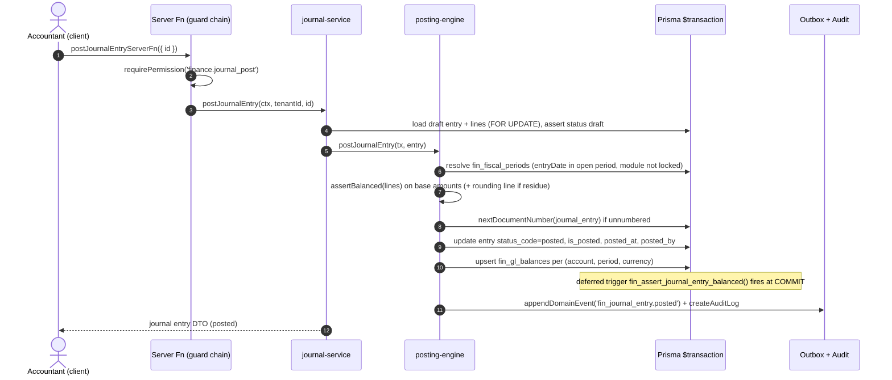

# Sequence Diagrams — Financial Management (Spec 006)

End-to-end flows through the canonical layering:

```
Client → server function (guard chain) → service ($transaction) → posting engine → repos + balances → outbox + audit
```

**Guard chain** (every tenant-scoped server function, `resolveContext` in
`src/features/finance/*-server-functions.ts`):

```
getCurrentUserContext({ accessToken, tenantId })
  → requireAuth(context)
  → requireTenantAccess(context, tenantId)
  → requirePermission(context, '<finance.*>')
```

**Canonical posting shape** (`posting-engine.postJournalEntry(tx, …)`):

```
resolvePeriod(entryDate)            # open period or PERIOD_CLOSED
  → resolveAccounts(...)            # rule line → mappings walk → settings default → suspense/throw
  → assertBalanced(lines)           # base amounts; rounding residue → rounding account
  → insert fin_journal_entries + fin_journal_lines (idempotency index → DUPLICATE_SOURCE)
  → upsert fin_gl_balances (INSERT … ON CONFLICT DO UPDATE)
  → write subledger rows (AR/AP) where applicable
  → appendDomainEvent('fin_journal_entry.posted') + createAuditLog
```

The deferred constraint trigger `fin_assert_journal_entry_balanced()` re-checks
balance at commit — the DB backstop behind the app assertion.

---

## (a) Manual journal entry — synchronous post (in-tx)



---

## (b) Operational document — asynchronous posting (queue)

Example: `PosSale` completed. Same shape for inventory movements, pod_ invoices
/ payments, restaurant orders.

```mermaid
sequenceDiagram
    autonumber
    participant POS as POS service (existing)
    participant DE as domain_events (outbox)
    participant C as finance consumer (fin_event_cursors)
    participant Q as fin_posting_queue
    participant AD as pos adapter (PostingContext)
    participant PE as posting-engine
    participant DB as Prisma $transaction
    participant N as notify()

    POS->>DE: appendDomainEvent(pos_sale completed) — unchanged write path
    C->>DE: poll events after cursor position
    C->>Q: insert queue row (dedupe unique tenant+sourceDoc+eventType)
    C->>C: advance fin_event_cursors.lastEventId
    loop queue drain (batch)
        Q->>AD: build PostingContext(sale, payments, mappings)
        AD->>PE: postJournalEntry(tx, context)
        alt success
            PE->>DB: JE + lines + gl balances (+ AR entry if on-account)
            PE->>Q: mark row posted (journalEntryId back-ref)
        else resolution failure (non-strict)
            PE->>DB: post to suspense account
            PE->>N: notify('finance.suspense_posting')
        else transient error
            Q->>Q: status failed, attemptCount+1, nextAttemptAt = backoff
            Note over Q: retried while attemptCount &le; 5
        else exhausted or DUPLICATE_SOURCE
            Q->>Q: status failed (terminal) / skipped
            Q->>N: notify('finance.posting_failed') → exceptions screen
        end
    end
```

---

## (c) Reversal / correction flow

Posted entries are immutable; correction = reversal + new entry.

```mermaid
sequenceDiagram
    autonumber
    actor U as Accountant (client)
    participant SF as Server Fn (guard chain)
    participant JS as journal-service
    participant PE as posting-engine
    participant DB as Prisma $transaction
    participant OUT as Outbox + Audit

    U->>SF: reverseJournalEntryServerFn({ id, reversalDate?, reason })
    SF->>SF: requirePermission('finance.journal_reverse')
    SF->>JS: reverseJournalEntry(ctx, tenantId, id)
    JS->>DB: load posted entry, assert not already reversed
    JS->>PE: buildReversalEntry(entry) — mirror lines (debit&harr;credit), reversal_of_entry_id
    PE->>DB: resolve period for reversalDate (must be open)
    PE->>DB: insert reversal JE (posted) + lines
    PE->>DB: upsert fin_gl_balances (negating deltas)
    PE->>DB: reverse subledger rows (remainingAmount restored / entry closed)
    JS->>DB: original entry status_code=reversed, reversed_by_entry_id
    JS->>OUT: appendDomainEvent('fin_journal_entry.reversed') + audit
    JS-->>U: { original: reversed, reversal: posted }
    Note over U: correction continues as a fresh draft JE (flow a)
```

---

## (d) AR receipt with allocation + realized FX

Fin-native document — synchronous posting.

```mermaid
sequenceDiagram
    autonumber
    actor U as AR Clerk (client)
    participant SF as Server Fn (guard chain)
    participant AR as ar-receipt-service
    participant PE as posting-engine
    participant DB as Prisma $transaction
    participant OUT as Outbox + Audit

    U->>SF: postArReceiptServerFn({ id })
    SF->>SF: requirePermission('finance.ar_receipt_post')
    SF->>AR: postReceipt(ctx, tenantId, id)
    AR->>DB: load fin_ar_receipts + fin_ar_receipt_allocations (FOR UPDATE)
    loop each allocation (sales_invoice | pos_sale | financial_note)
        AR->>DB: lock fin_customer_ledger_entries open item
        AR->>DB: insert fin_customer_ledger_applications, reduce remainingAmount
        AR->>AR: realizedFx = allocated &times; (receiptRate − invoiceRate)
    end
    AR->>PE: postJournalEntry(tx) — Dr Bank/Cash, Cr AR control, Dr/Cr Realized FX
    PE->>DB: JE + lines + gl balances
    AR->>DB: insert fin_customer_ledger_entries (payment, remaining = unallocated)
    AR->>DB: receipt status_code=posted
    AR->>OUT: appendDomainEvent + createAuditLog
    AR-->>U: receipt DTO (posted, per-invoice application detail)
```

---

## (e) AP payment run — propose → approve → execute

```mermaid
sequenceDiagram
    autonumber
    actor U as AP Manager (client)
    actor A as Approver
    participant SF as Server Fn (guard chain)
    participant PR as payment-run-service
    participant AP as pod_approval engine
    participant PY as supplier-payment-service (005)
    participant PE as posting-engine
    participant DB as Prisma $transaction

    U->>SF: proposePaymentRunServerFn({ dueBefore, supplierIds? })
    SF->>SF: requirePermission('finance.payment_run_manage')
    SF->>PR: propose(ctx, tenantId, criteria)
    PR->>DB: select open fin_vendor_ledger_entries (remaining > 0, dueDate &le; dueBefore)
    PR->>DB: insert fin_payment_runs + fin_payment_run_lines (status proposed)
    PR-->>U: run DTO (proposed, totals per supplier)

    U->>SF: submitPaymentRunServerFn({ id })
    SF->>AP: openRequest(entity_type payment_run, amount = run total)
    AP->>DB: pod_approval_requests (pending), run holds at proposed
    A->>AP: approve (final step)
    AP->>DB: run status_code=approved

    U->>SF: executePaymentRunServerFn({ id })
    SF->>PR: execute(ctx, tenantId, id)
    loop per supplier group
        PR->>PY: createPayment + allocations (PodSupplierPayment rows)
        PR->>PY: postSupplierPayment(tx) — 005 flow, emits supplier_payment.posted
    end
    Note over PE: payments post to GL via the async queue (flow b)
    PR->>DB: run status_code=executed, line back-refs to payment ids
    PR-->>U: run DTO (executed)
```

---

## (f) Period close

```mermaid
sequenceDiagram
    autonumber
    actor U as Controller (client)
    participant SF as Server Fn (guard chain)
    participant CL as close-service
    participant DB as Prisma $transaction
    participant N as notify()

    U->>SF: startPeriodCloseServerFn({ periodId })
    SF->>SF: requirePermission('finance.fiscal_manage')
    SF->>CL: startClose(ctx, tenantId, periodId)
    CL->>DB: insert fin_period_close_runs + tasks from fin_close_task_templates
    CL-->>U: checklist DTO (pending tasks)

    loop each checklist task
        U->>SF: completeCloseTaskServerFn({ taskId })
        CL->>DB: task done (auto-checks: queue drained, no draft JEs, recon complete)
    end

    U->>SF: lockModuleServerFn({ periodId, module: 'inventory' })
    CL->>DB: upsert fin_period_module_locks (soft close per module)
    Note over DB: posting engine rejects that module's JEs → PERIOD_CLOSED

    U->>SF: closePeriodServerFn({ periodId })
    CL->>DB: assert all tasks complete + queue empty for period
    CL->>DB: fin_fiscal_periods status future→open→closed transition (closed)
    CL->>N: notify('finance.period_closed')
    CL-->>U: period DTO (closed; lock separately for hard lock)
```

---

## (g) Year close — P&L sweep → retained earnings → opening entry

```mermaid
sequenceDiagram
    autonumber
    actor U as Controller (client)
    participant SF as Server Fn (guard chain)
    participant YC as year-close-service
    participant PE as posting-engine
    participant DB as Prisma $transaction

    U->>SF: runYearCloseServerFn({ fiscalYearId })
    SF->>SF: requirePermission('finance.fiscal_manage')
    YC->>DB: assert all periods closed (incl. adjustment period 13)
    YC->>DB: insert fin_year_close_runs (running)
    YC->>DB: read fin_gl_balances for all P&L accounts (income + expense classes)
    YC->>PE: post closing JE in period 13 — sweep each P&L balance to zero, net → Retained earnings
    PE->>DB: JE + lines + balances (closing entry flagged is_closing)
    YC->>PE: post opening JE in next year period 1 — balance-sheet balances carried forward
    PE->>DB: opening entry (is_opening)
    YC->>DB: fiscal year status closed; run completed
    YC-->>U: { closingEntryId, openingEntryId, retainedEarningsDelta }
```

---

## (h) Bank statement import + reconciliation matching

```mermaid
sequenceDiagram
    autonumber
    actor U as Treasurer (client)
    participant SF as Server Fn (guard chain)
    participant BK as bank-service
    participant MR as fin_bank_matching_rules
    participant DB as Prisma $transaction

    U->>SF: importBankStatementServerFn({ bankAccountId, lines[] })
    SF->>SF: requirePermission('finance.bank_manage')
    BK->>DB: insert fin_bank_statements + fin_bank_statement_lines
    Note over DB: dedupe on (tenant, bankAccount, externalId) — re-import is a no-op
    BK-->>U: statement DTO (n lines, unmatched)

    U->>SF: startReconciliationServerFn({ bankAccountId, statementId })
    BK->>DB: insert fin_bank_reconciliations (draft, statement vs GL balance)
    BK->>MR: run matching rules (amount+date tolerance, reference regex)
    loop each auto-match
        BK->>DB: insert fin_bank_reconciliation_matches (statement line &harr; journal line / cheque)
    end
    BK-->>U: recon DTO (auto-matched %, unmatched list)

    U->>SF: matchReconciliationLineServerFn({ lineId, journalLineId })
    BK->>DB: manual match row; card-clearing / cheque lines clear their in-transit account
    U->>SF: completeReconciliationServerFn({ id })
    BK->>DB: assert difference = 0 (or post adjustment JE for fees/interest)
    BK->>DB: recon status_code=completed; statement lines matched
    BK-->>U: recon DTO (completed)
```
