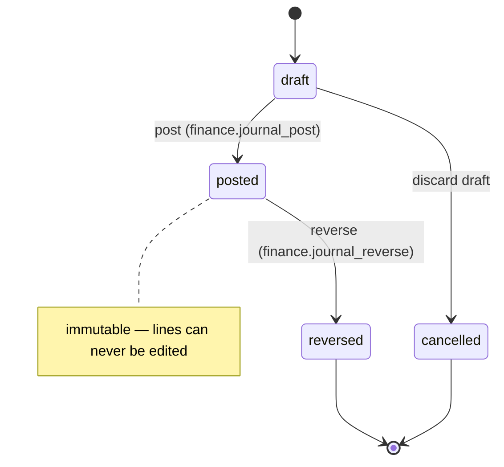
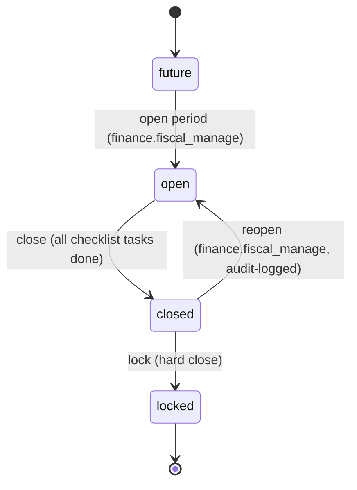
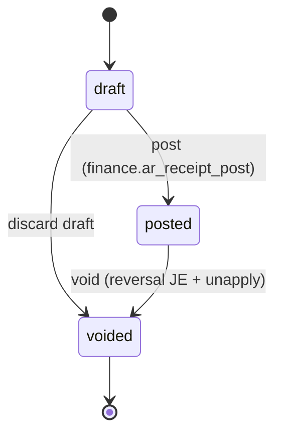
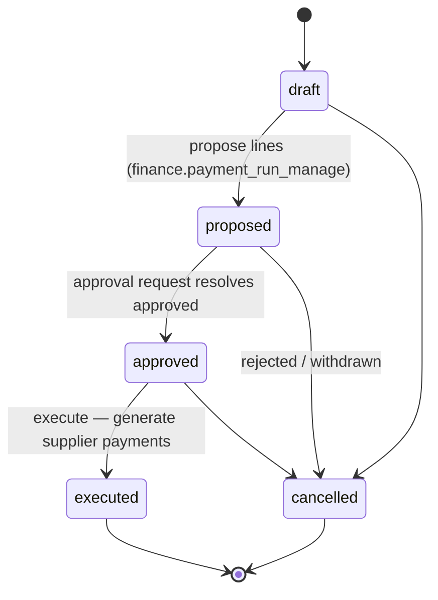
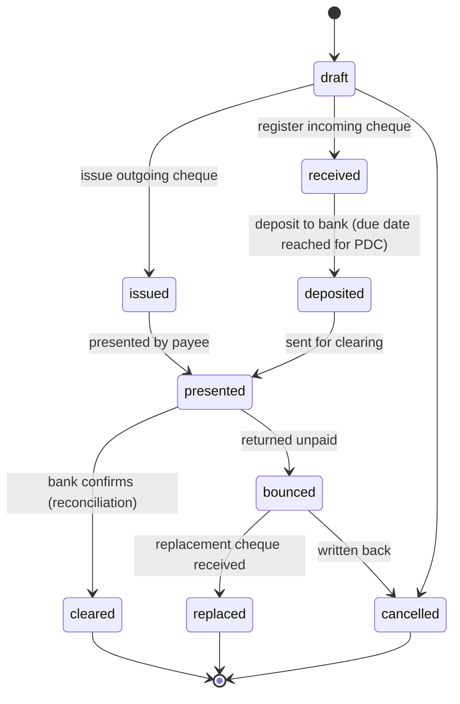
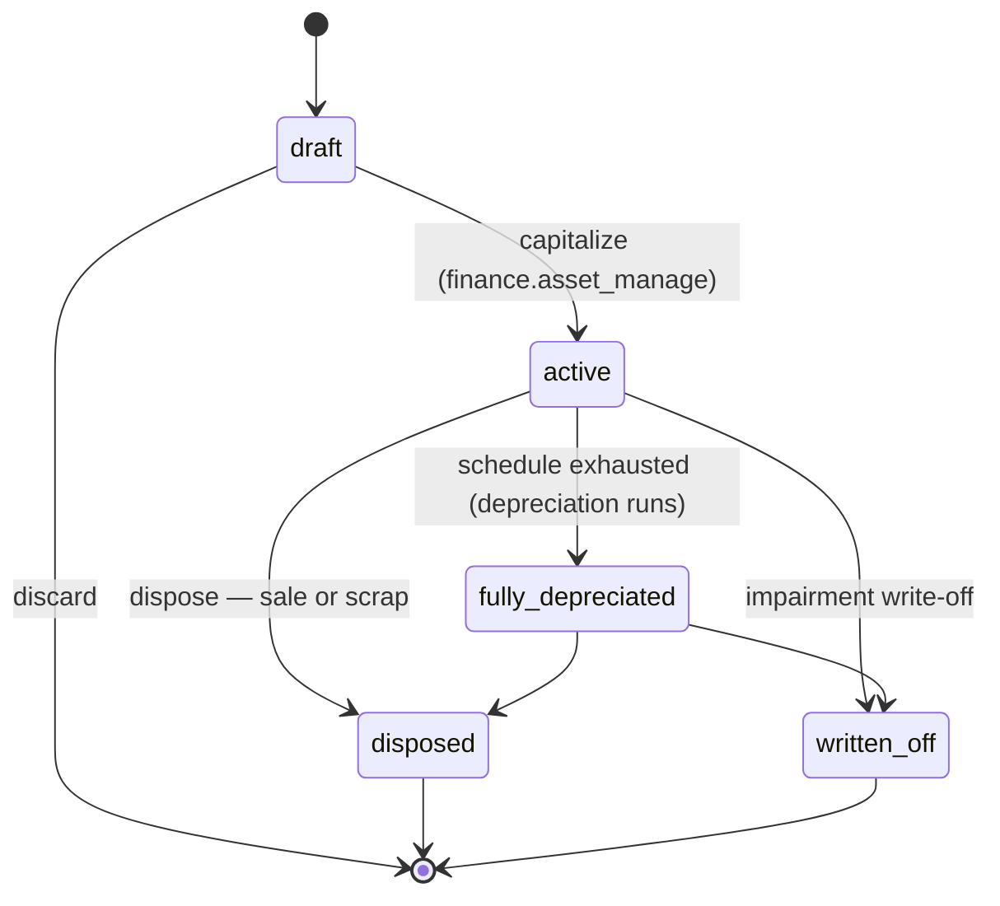
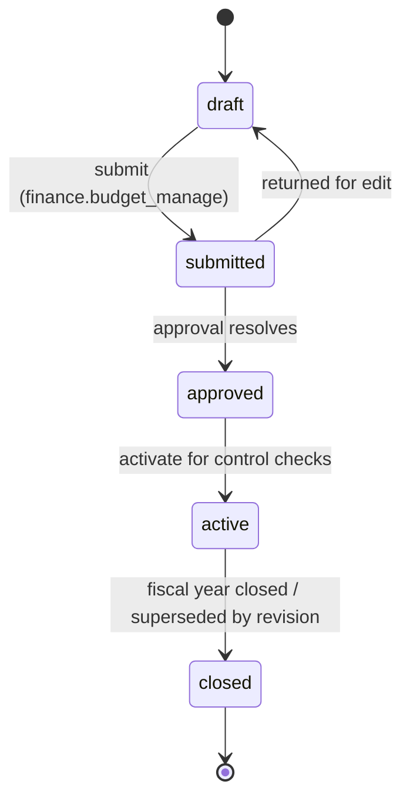
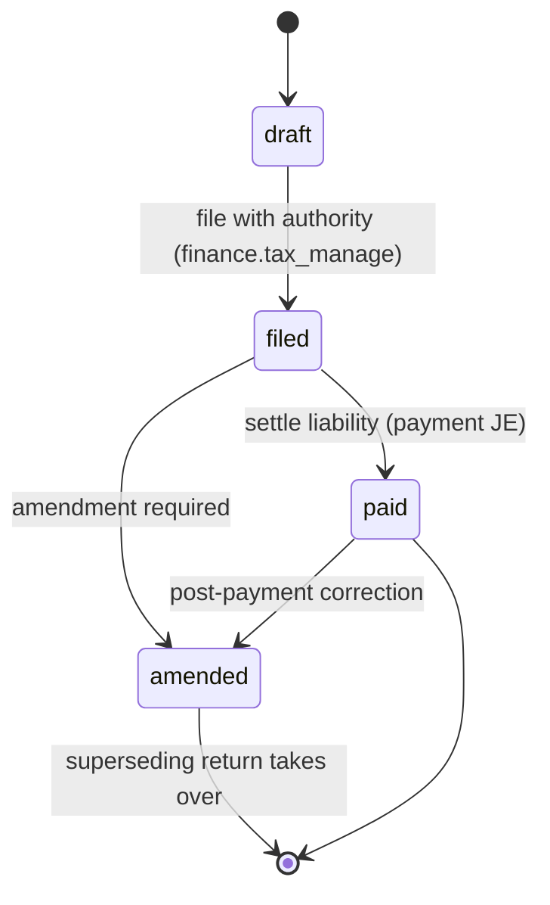
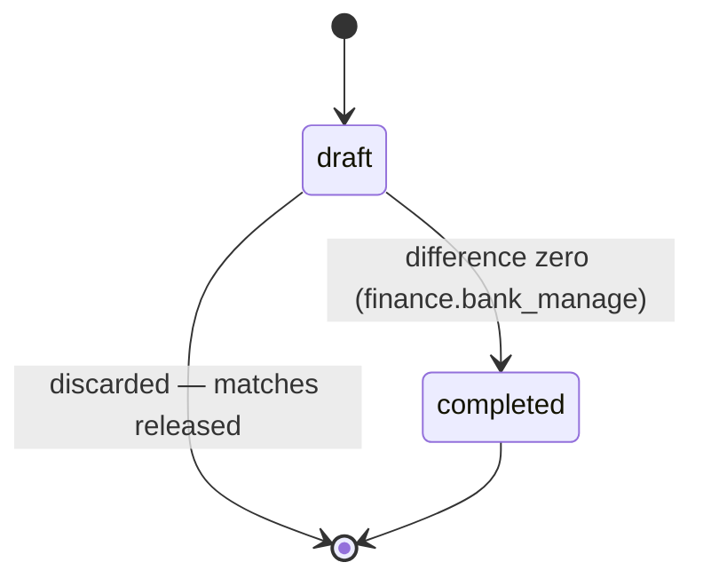
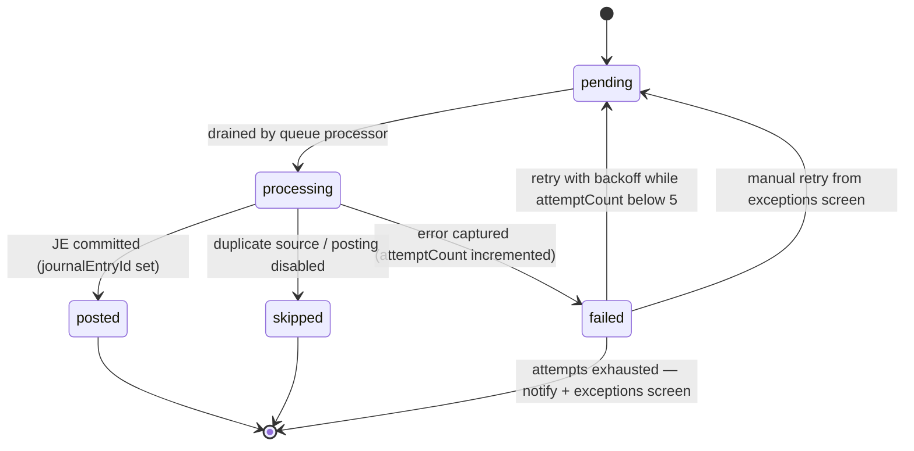

# State Diagrams — Financial Management (Spec 006)

Lifecycle diagrams for every fin_ document. All fin documents use the
**lookup-table status regime**: `statusCode` strings backed by
`PodDocumentStatus` (per `entity_type`) with legal edges in
`PodStatusTransition` — no new Prisma enums. Each diagram below mirrors exactly
the rows seeded in the fin migration
(`20260718110000_financial_management_enterprise_v1`).

A `NULL`-tenant status row is the global default; tenants may extend a lifecycle
without a code change. `requires_permission` on a transition row gates an edge
(e.g. only `finance.journal_post` may post). Immutable ledger rows
(`fin_journal_lines`, `fin_customer/vendor_ledger_entries`,
`fin_tax_transactions`, `fin_gl_balances`) carry **no status** — they exist or
they don't; corrections are reversals.

---

## Journal Entry — `entity_type = 'journal_entry'`

Initial: `draft`. Terminal: `reversed`, `cancelled`. `posted` is immutable —
the only outgoing edge is reversal (which creates a mirror entry, itself born
`posted`). Async-sourced entries are created directly in `posted` by the
posting engine (no draft stage).

---

## Fiscal Period — `entity_type = 'fiscal_period'`

Initial: `future`. Terminal: `locked`. `closed → open` is the controlled reopen
path (`finance.fiscal_manage`); `locked` is the hard close with **no** reopen
edge. Module-level soft close rides alongside in `fin_period_module_locks` and
is independent of the header status.

---

## AR Receipt — `entity_type = 'ar_receipt'`

Initial: `draft`. Terminal: `voided`. Posting writes the JE + customer ledger
entry + applications in one tx; `voided` reverses all three (reversal JE,
applications unwound, open items restored).

---

## Payment Run — `entity_type = 'payment_run'`

Initial: `draft`. Terminal: `executed`, `cancelled`. Approval is routed through
`pod_approval_*` (`entity_type = payment_run`); the run holds at `proposed`
until the request resolves. Execution generates `PodSupplierPayment` documents,
which then follow their own Spec-005 lifecycle.

---

## Cheque — `entity_type = 'cheque'`

Covers both directions (`chequeDirection` issued | received), including
post-dated cheques (PDC): a received PDC sits at `received` until its due date,
then is deposited. Terminal: `cleared`, `replaced`, `cancelled`. Each transition
posts its JE (deposit → cheque-in-transit, clear → bank, bounce → reverse +
bounce fee).

---

## Fixed Asset — `entity_type = 'asset'`

Initial: `draft` (register entry, possibly capitalized from a supplier invoice
via `sourceDoc`). Terminal: `disposed`, `written_off`. `fully_depreciated`
assets remain on the register (NBV = residual) until disposal.

---

## Budget — `entity_type = 'budget'`

Initial: `draft`. Terminal: `closed`. Approval via `pod_approval_*`
(`entity_type = budget`). Only one `active` budget per fiscal year + budget type;
revisions clone into a new `draft` linked via `fin_budget_revisions`.

---

## Tax Return — `entity_type = 'tax_return'`

Initial: `draft` (lines aggregated from `fin_tax_transactions` by reporting
box). Terminal: `paid` unless amended; `amended` spawns a fresh `draft` return
linked to the original.

---

## Bank Reconciliation — `entity_type = 'bank_reconciliation'`

Initial: `draft`. Terminal: `completed`. Completion requires difference = 0
(adjustment JEs for fees/interest may be posted from within the draft).
A completed reconciliation is immutable; corrections happen in the next one.

---

## Posting Queue Row — `entity_type = 'posting_queue'`

Initial: `pending`. Terminal: `posted`, `skipped`, and `failed` once
`attemptCount` reaches 5 (visible in the exceptions screen; a manual retry
resets it to `pending`). `skipped` = idempotency hit (`DUPLICATE_SOURCE`) or
event type configured off in `fin_settings.postingModes`.

