# ERD — Feature 007 (HR / HCM)

Mermaid ERDs grouped by domain cluster across the **88 `hr_` tables**. As in the
006 ERDs, only two kinds of link are real DB foreign keys, drawn as solid
crow's-foot lines:

1. The **tenant** relationship — every `hr_*` table carries
   `tenant_id → tenant_accounts` (real FK, `onDelete: Cascade`). It is shown once
   in the tenant-scope block below and omitted from the per-domain diagrams for
   readability.
2. The **`HrEmployee` composition** — only `hr_employees` declares Prisma
   `@relation`s to its eleven owned sub-tables (contacts, addresses, documents,
   bank accounts, contracts, history, dependents, education, experience,
   certifications, languages). Those are real cascading FKs.

**Every other reference is a bare scalar UUID with app-enforced integrity**,
drawn as a dashed `||..o{` link — this includes intra-HR references
(`employee_id` on time/leave/payroll rows, `department_id`, `position_id`,
`manager_id`, `leave_type_id`, `payroll_run_id`, …) and all cross-module
references. Statuses use free-string `status_code` / `stage_code` /
`employment_status` columns against the `pod_document_statuses` registry — no
new Prisma enums. Money is `Decimal(19,4)`.

Cross-module references are annotated scalar UUIDs pointing at foreign
aggregates (shown as attribute-less entities): `profiles` (`profile_id`,
`created_by`, approver ids), `fin_accounts` (`gl_account_id`),
`fin_cost_centers` (`fin_cost_center_id`), `fin_journal_entries`
(`journal_entry_id`), `pod_approval_requests` (`approval_request_id`),
`products` (`product_id`), `fin_assets` (`fin_asset_id`), `warehouses`
(`warehouse_id`).

## Tenant scope (applies to every table)

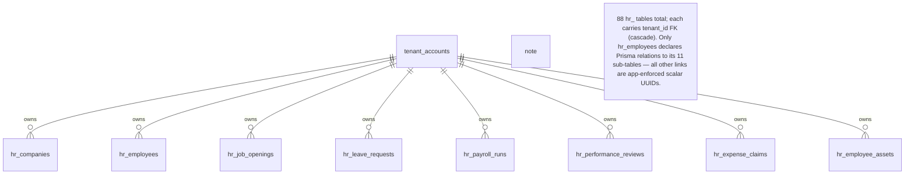

## Domain 1 — Organization Management

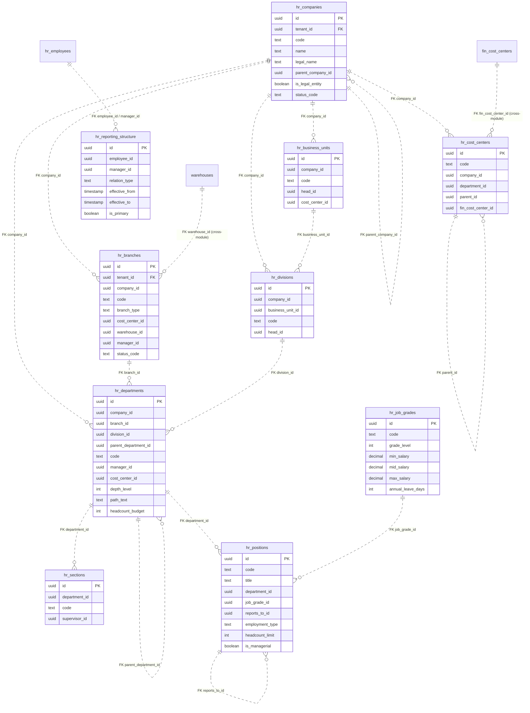

## Domain 2 — Employee Master + sub-tables

The only cluster with real Prisma `@relation` FKs (solid lines): `hr_employees`
owns its eleven sub-tables with `onDelete: Cascade`.

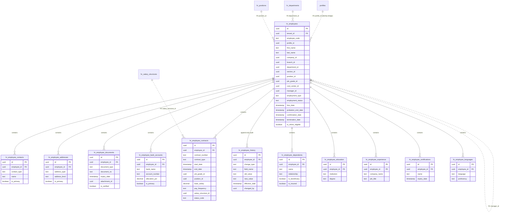

## Domain 3 — Recruitment (ATS)

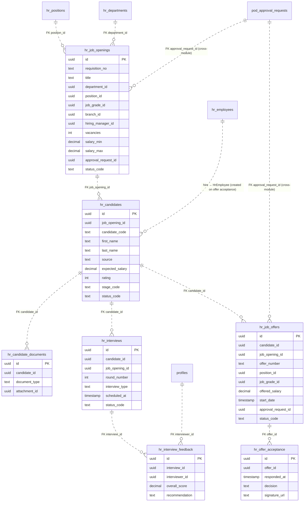

## Domain 4 — Onboarding

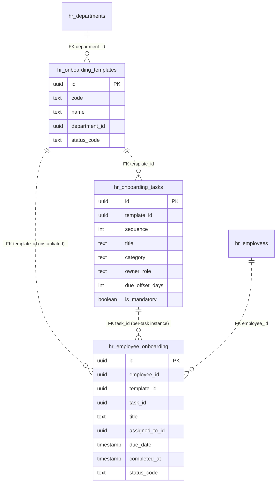

## Domain 5 — Time Management

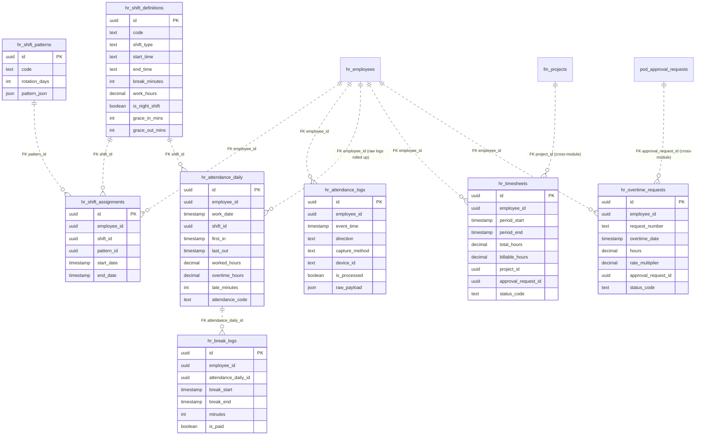

## Domain 6 — Leave Management

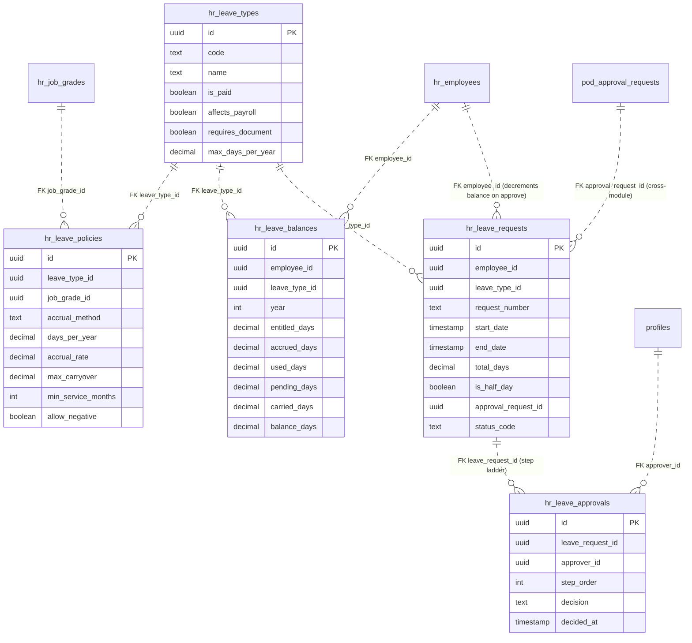

## Domain 7 — Payroll & Benefits

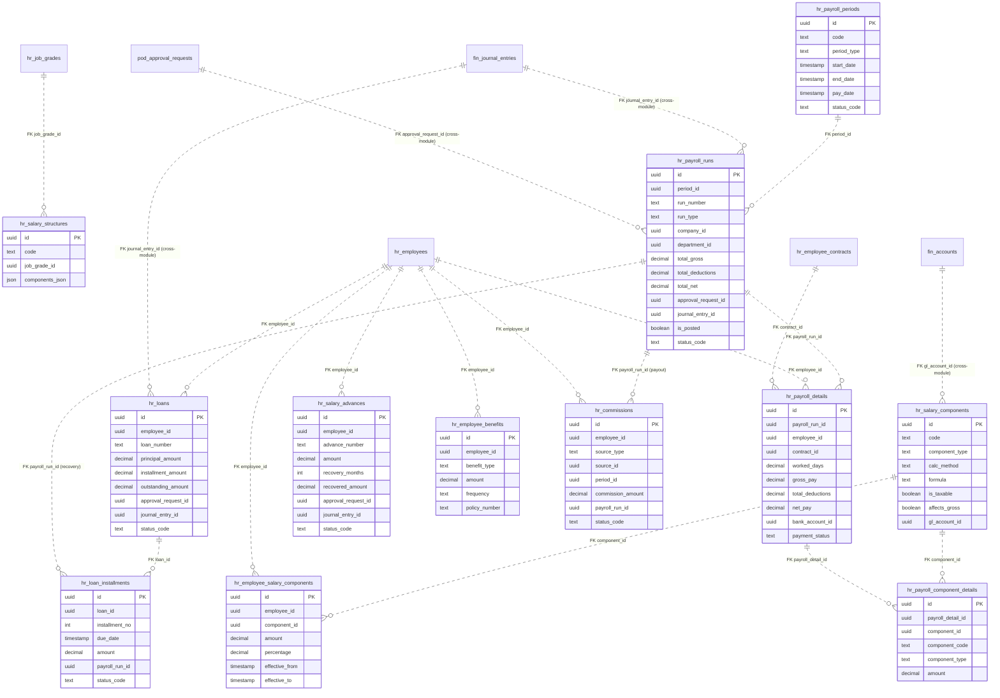

## Domain 8 — Performance Management

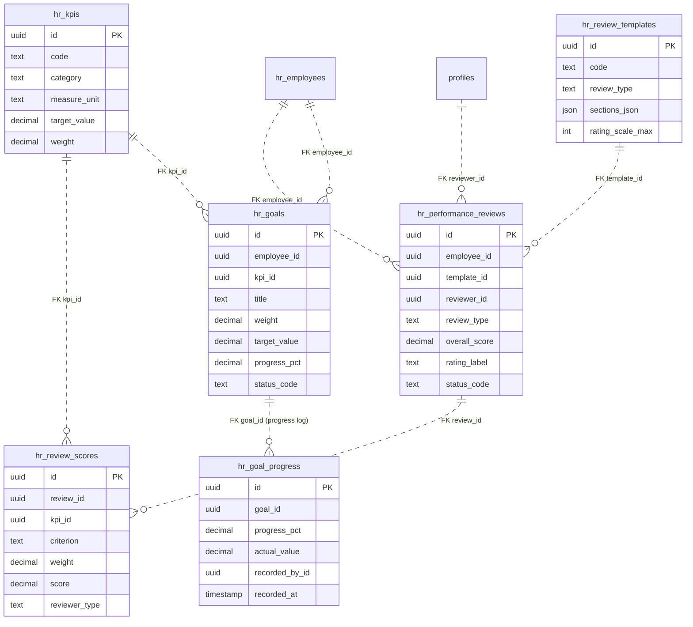

## Domain 9 — Learning & Training

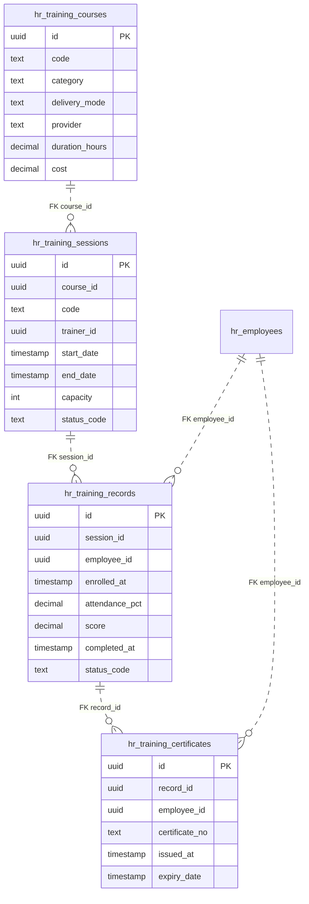

## Domain 10 — Career, Succession & Workforce Planning

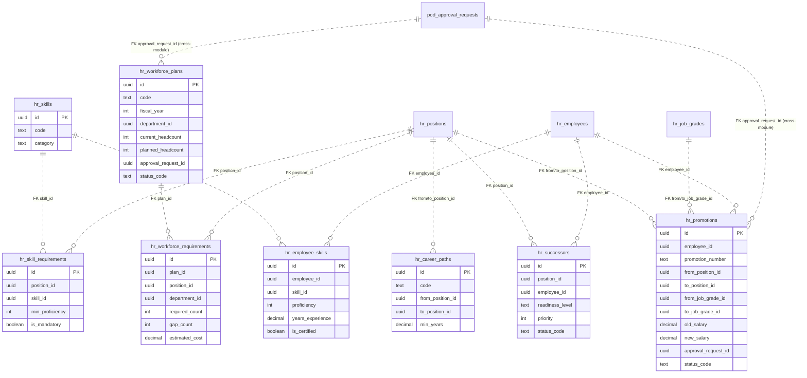

## Domain 11 — HR Budgeting

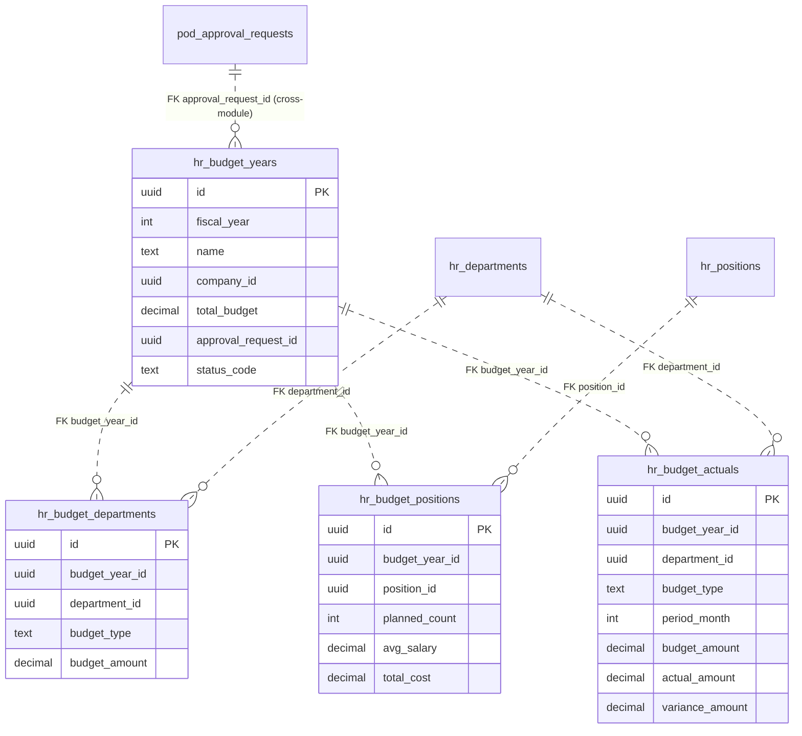

## Domain 12 — Employee Self Service (ESS)

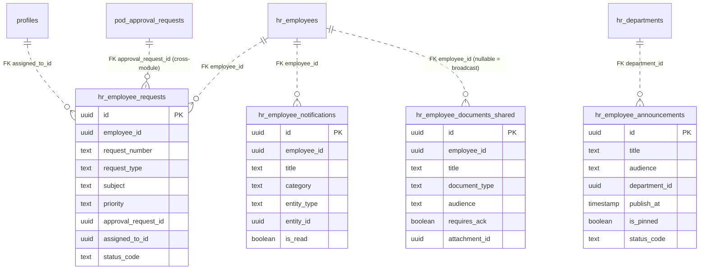

## Domain 13 — Asset Assignment (Inventory / Fixed-asset integration)

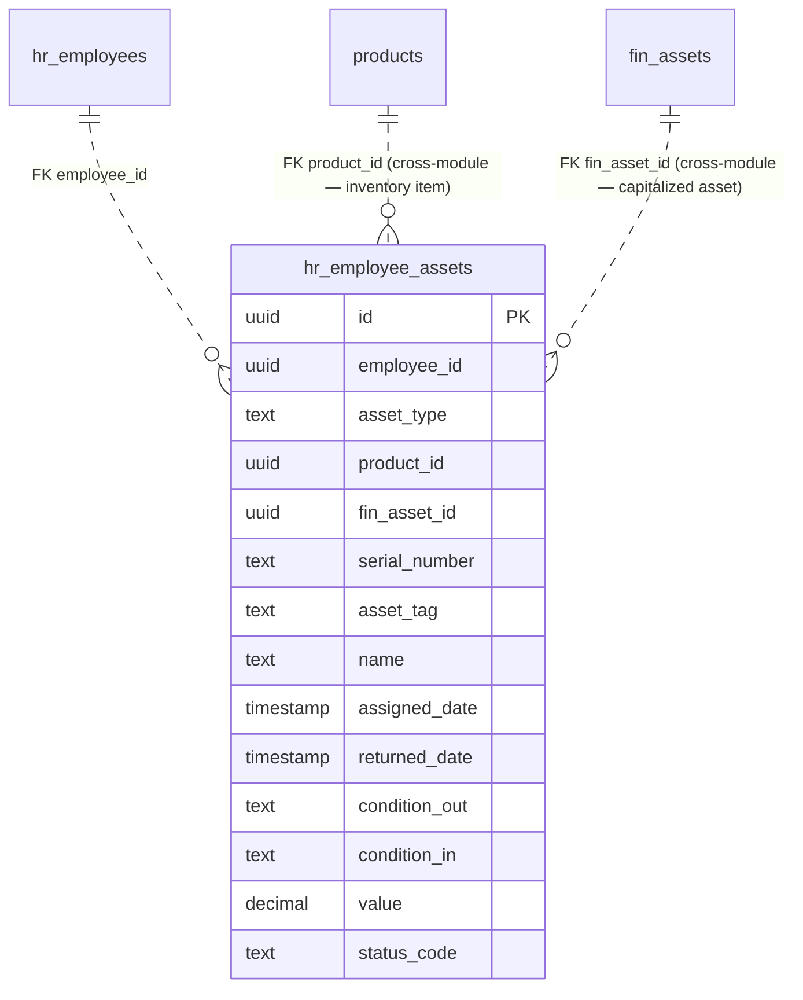

## Domain 14 — Travel & Expense

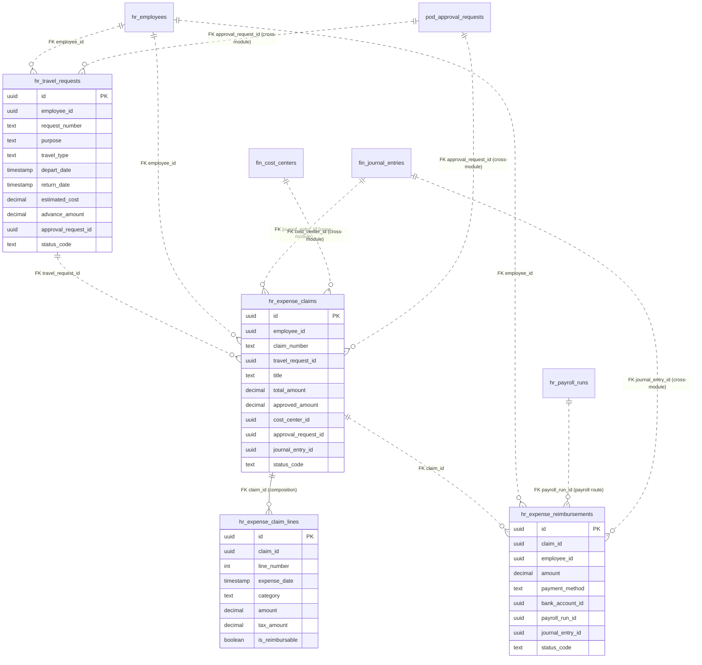

## Cross-module integration summary

`hr_employees` is the hub the entire module hangs off (its `profile_id` bridges
to `profiles` / Supabase identity). HR posts money into Finance through
`journal_entry_id` back-references on payroll runs, loans, salary advances,
expense claims and reimbursements — the same async outbox → `fin_posting_queue`
pipeline the 006 module documents. Approvals for every routed HR document
(leave, overtime, timesheet, payroll run, loan, promotion, budget, travel,
expense) are delegated to the shared `pod_approval_*` engine via
`approval_request_id`. Asset assignments bridge to `products` (inventory) and
`fin_assets` (fixed-asset register).

```mermaid
erDiagram
  profiles ||..o{ hr_employees : "identity bridge (profile_id)"
  hr_payroll_runs ||..o{ fin_journal_entries : "payroll.posted → GL"
  hr_expense_claims ||..o{ fin_journal_entries : "expense.posted → GL"
  hr_expense_reimbursements ||..o{ fin_journal_entries : "reimbursement.paid → GL"
  hr_loans ||..o{ fin_journal_entries : "loan.disbursed → GL"
  hr_salary_advances ||..o{ fin_journal_entries : "advance.disbursed → GL"
  hr_leave_requests ||..o{ pod_approval_requests : "approval routing"
  hr_payroll_runs ||..o{ pod_approval_requests : "approval routing"
  hr_promotions ||..o{ pod_approval_requests : "approval routing"
  hr_travel_requests ||..o{ pod_approval_requests : "approval routing"
  hr_expense_claims ||..o{ pod_approval_requests : "approval routing"
  hr_employee_assets ||..o{ products : "inventory item link"
  hr_employee_assets ||..o{ fin_assets : "capitalized asset link"
  hr_salary_components ||..o{ fin_accounts : "GL mapping per component"
  hr_cost_centers ||..o{ fin_cost_centers : "cost dimension bridge"
```
