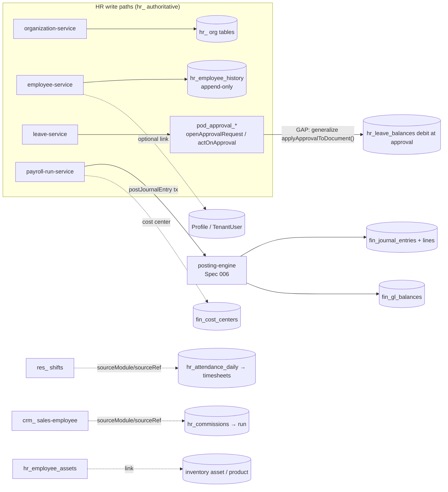

# Integration — HR / HCM (Spec 007)

How the `hr_` people layer plugs into every existing module. The design rule is **hr_ is
authoritative for people data and consumes shared infrastructure — it never mutates another
module's tables**: identity (`Profile` / `TenantUser`), accounting (`fin_`), inventory, restaurant
`res_`, and CRM `crm_` all stay operational-authoritative; HR links to them by scalar FK or
`sourceModule`/`sourceRef` mapping and posts financial consequences through the Spec 006 posting
engine. **Zero breaking changes to existing modules.**

| Concern | Reused module | Spec-007 addition |
|---|---|---|
| Accounting | `postJournalEntry` (`src/server/finance/posting-engine.ts`) + `fin_cost_centers` | payroll runs, loan/advance disbursement, expense reimbursement post through the engine; `hr_cost_centers` → `fin_cost_centers` |
| Numbering | `document-number-service.ts` + `document_sequences` | 13 new `DocumentType` values (`employee`, `payroll_run`, `leave_request`, …) + `DEFAULT_PREFIX` entries |
| Approvals | `pod_approval_*` polymorphic engine (`src/server/purchasing/approval-engine.ts`) | leave/offer/loan/payroll/expense/travel via `openApprovalRequest` / `actOnApproval` — **requires engine generalization (see §2)** |
| Notifications | `notify(tx, …)` (`src/server/notifications/notification-service.ts`) + `PodNotification` | onboarding tasks, leave/expense approvals, run completion, announcements |
| Attachments | `registerAttachment` / `listAttachments` + `PodAttachment` | employee/candidate documents, offer letters, certificates, payslips (binary in Supabase bucket) |
| Statuses | `PodDocumentStatus` / `PodStatusTransition` registry | hr entity-type rows seeded (no new Prisma enums) |
| Audit | `createAuditLog` + `audit_logs` | every employee edit / leave decision / payroll post / reversal writes an audit row in-tx |
| Identity | `Profile` / `TenantUser` / RBAC | `hr_employees.profileId` optional login link (unchanged identity) |
| Inventory | inventory asset / product masters | `hr_employee_assets` custody link (zero-touch) |
| Restaurant / CRM | `res_` shifts, `crm_` sales-employee data | `sourceModule` / `sourceRef` link for shift→payroll and commission/tip inputs |

---

## 0. Posting architecture (recap)

HR posts through the **synchronous** Spec-006 path only in this design:

- **Sync (in-tx)** — an HR document with a financial consequence (a posted payroll run, a loan
  disbursement, an expense reimbursement) calls `postJournalEntry(tx, …)` inside its own
  `$transaction`; failure rolls back the HR document. There is **no HR async posting adapter** — the
  Spec-006 finance async adapters (`domain_events` → finance consumer → `fin_posting_queue`) are
  themselves unregistered, so there is no consumer to enqueue into. Payroll posts directly, idempotent
  per `hr_payroll_run.id`, reversal-only for corrections. Registering payroll as an async `fin_`
  adapter is a documented later gap (see `plan.md` Risks).

Idempotency mirrors the Spec-006 contract: the posting engine's partial unique index on
`fin_journal_entries (tenant_id, source_doc_type, source_doc_id, source_event_type)
WHERE status_code = 'posted' AND reversal_of_entry_id IS NULL` guarantees **one posted JE per HR
source document** — a re-post is a no-op, a reversal is exempt by design.

**Account resolution** reuses the Spec-006 walk: posting-rule fixed account → `fin_account_mappings`
walk → `fin_settings` named default → suspense + notify. HR seeds its own mapping roles (§7).

---

## 1. Finance / Accounting (Spec 006) — the primary integration

HR is the **payroll module Feature 006 deferred** ("a future payroll module posts through the same
posting engine"). Every HR event with an accounting consequence posts through `postJournalEntry`;
HR **never** writes `fin_journal_entries` / `fin_journal_lines` / `fin_gl_balances` directly.

**Cost attribution.** `hr_cost_centers` carries a nullable scalar FK to `fin_cost_centers`. Each
posted line is tagged with the employee's cost center → `fin_cost_centers`, so payroll cost lands on
the same accounting dimension the rest of the ledger uses — no duplicated dimension, no touch to
`fin_` tables.

**Idempotency per source doc.** Each HR posting passes
`postJournalEntry(tx, { sourceDocType, sourceDocId, sourceEventType, lines })` where `sourceDocType`
is one of `hr_payroll_run` | `hr_loan` | `hr_expense_claim`, `sourceDocId` is the HR document id, and
the Spec-006 idempotency index enforces at-most-once posting. A re-post of a posted run is a no-op;
corrections are an **off-cycle adjustment run** or a **reversal** of the run's JE — never an edit.

| HR event | Debit | Credit | Amount source | Notes |
|---|---|---|---|---|
| Payroll run posted (`hr_payroll_run`) | Salary expense + employer-contribution expense (per cost center) | Net-pay liability + statutory liabilities + loan-recovery + advance-recovery | `hr_payroll_details` / `hr_payroll_component_details` gross, deductions, employer cost, net | one balanced JE per run; rounding residue → configured rounding account; idempotent per run id; reversal-only |
| Loan disbursement (`hr_loan`) | Loan receivable (employee advance) | Cash / bank (per payment method mapping) | `hr_loans.principal` | posted when disbursed; recovered later via payroll deduction (no direct fin write) |
| Salary advance payout (`hr_salary_advance`) | Advance receivable | Cash / bank | `hr_salary_advances.amount` | recovered in full or by schedule through the run |
| Loan / advance recovery | (net-pay liability composition inside the run JE) | Loan/advance receivable | scheduled installment amount | an installment recovered by **at most one** posted run — no double recovery |
| Expense reimbursement (`hr_expense_claim`) | Expense by line category (per cost center) | Net-pay liability **or** AP liability | `hr_expense_claim_lines` totals | payroll-routed → added as a non-taxable net-pay component; AP-routed → `fin_` AP liability |
| Benefit employer cost | Employer-contribution expense | Benefit liability | benefit component amount | accrues through the run as an employer-contribution component |

**HR budget reconciliation.** `hr_budget_actuals` compares planned headcount/cost against actuals
read from `fin_gl_balances` for the payroll accounts — a **read**, not a posting; the GL stays the
accounting system of record.

## 2. Approval engine (`pod_approval_*`) — reuse + the required generalization

HR reuses `openApprovalRequest` / `actOnApproval` from
`src/server/purchasing/approval-engine.ts` for every approval-gated HR document:
`hr_leave_request`, `hr_overtime_request`, `hr_loan`, `hr_salary_advance`, `hr_payroll_run`,
`hr_promotion`, `hr_expense_claim`, `hr_travel_request`, `hr_job_offer`. The source HR document
stores `approvalRequestId` and holds at `pending_approval`, exactly as Spec-005 documents do.

**GAP (must be closed in Phase 4 before the first approval-gated HR document).**
`applyApprovalToDocument()` in `approval-engine.ts` (≈ line 37) is a **hard-coded switch over
purchasing entity types**, and on decision it emits a purchasing-specific
`purchase_approval.decided` domain event plus purchasing-shaped audit keys (≈ lines 167, 333–344).
To reuse the engine for HR:

1. **Extend the switch** with `hr_leave_request` / `hr_overtime_request` / `hr_loan` /
   `hr_salary_advance` / `hr_payroll_run` / `hr_promotion` / `hr_expense_claim` / `hr_travel_request`
   / `hr_job_offer` branches, each applying the approved/rejected status transition to the HR
   document **in the same transaction** (e.g. leave approval debits `hr_leave_balances`; offer
   acceptance decrements opening headcount).
2. **Generalize the event/audit keys** so the emitted domain event and audit row reflect the actual
   entity type (e.g. `approval.decided` with the entity type in the payload, or a per-entity event
   key) rather than always `purchase_approval.decided`.
3. Keep the dispatch **table-driven** so later modules extend by registration, not by editing a
   monolith.

Leave balance impact is computed **at approval, never at request** — the debit happens in the same
tx as `actOnApproval` recording the `hr_leave_approvals` row.

## 3. Notifications (`notify`)

HR calls `notify(tx, …)` in the same transaction for: onboarding task assignment/completion, leave
request submitted / approved / rejected, expense claim routed / approved, payroll run completed /
posted, offer extended / accepted, announcement broadcast, and (Phase 11) ESS
`hr_employee_notifications` mirrored to `pod_notifications`. No new notification infrastructure —
HR registers notification kinds and reuses the transport.

## 4. Documents / attachments (`registerAttachment`)

Employee documents, candidate CVs/portfolios, offer letters, training certificates, and shared
payslips/letters attach via `registerAttachment` / `listAttachments`; binaries live in the Supabase
bucket exactly as `pod_` / `fin_` documents do. HR registers its entity types
(`hr_employee_document`, `hr_candidate_document`, `hr_training_certificate`,
`hr_employee_document_shared`) with the attachment service; the tables carry only metadata + the
attachment reference, never the binary.

## 5. Inventory — asset custody

`hr_employee_assets` links an inventory asset / product to an employee with issue/return dates and
condition — a **custody trail**, zero-touch to inventory tables. Issue opens a custody record;
return or reassignment closes the prior record and (for reassignment) opens a new one. No inventory
movement or costing is triggered; the inventory item remains the operational/accounting master (and,
where capitalized, a `fin_assets` row under Spec 006).

## 6. CRM & Restaurant — variable payroll inputs

- **CRM** — sales-employee commission and KPI/target attainment feed `hr_commissions` via
  `sourceModule = 'crm'` / `sourceRef` (the CRM sales/target document id). The commission surfaces as
  a variable component in the payroll run; CRM keeps its own sales truth, HR shadows only the payable.
- **Restaurant (`res_`)** — waiter/chef/cashier staffing shifts link into the Time & Attendance
  pipeline via `sourceModule = 'res'` / `sourceRef`, so restaurant worked hours and **tips** flow
  through the same `hr_attendance_daily` → `hr_timesheets` → payroll path (shift→payroll). Tips
  captured on `res_` orders surface as a variable `hr_commissions`/net-pay component; the restaurant
  tip-liability accounting (Spec-006 §4) and the payroll payout of tips are two sides that meet at the
  configured tips-payable account.

## 7. Cross-cutting reuse

- **Numbering** — `nextDocumentNumber(tx, { tenantId, documentType })` unchanged; Spec 007 adds
  `DocumentType` values (`employee`, `employee_contract`, `job_opening`, `job_offer`, `onboarding`,
  `timesheet`, `leave_request`, `payroll_run`, `loan`, `salary_advance`, `expense_claim`,
  `travel_request`, `performance_review`) + `DEFAULT_PREFIX` entries (`EMP`, `EMPC`, `JOB`, `OFR`,
  `ONB`, `TMS`, `LVR`, `PAY`, `LOAN`, `ADV`, `EXP`, `TRV`, `PRV`).
- **Statuses** — every hr document registers rows in `PodDocumentStatus` / `PodStatusTransition`
  (`entity_type` = `employee`, `employee_contract`, `job_opening`, `job_offer`, `onboarding`,
  `timesheet`, `leave_request`, `payroll_period`, `payroll_run`, `loan`, `salary_advance`,
  `expense_claim`, `travel_request`, `performance_review`); **no new Prisma enums**.
- **Audit** — every employee edit, leave decision, payroll post/reverse, and expense reimbursement
  writes an `audit_logs` row in-tx via `createAuditLog`.
- **Identity** — `hr_employees.profileId` links at most one `Profile` (login); an employee may exist
  without a login and a login without an employee. RBAC/`TenantUser` stay the authorization
  mechanism.

### hr_account_mappings / posting roles (per HR flow)

HR reuses the Spec-006 `fin_account_mappings` walk (product/category/warehouse/branch/payment-method/
party-group) plus `fin_settings` named defaults. HR-specific mapping roles it must be able to seed:

| Flow | mappingRole(s) |
|---|---|
| Payroll — earnings | `salary_expense`, `overtime_expense`, `bonus_expense`, `commission_expense` |
| Payroll — employer cost | `employer_contribution_expense`, `benefit_expense` |
| Payroll — liabilities | `net_pay_liability`, `statutory_liability`, `tips_payable`, `payroll_rounding` |
| Loans / advances | `loan_receivable`, `advance_receivable`, `loan_recovery`, `advance_recovery` |
| Expense / travel | `expense_by_category`, `expense_ap_liability` |

Each role also resolves via a **named default on `fin_settings`** as the last-resort fallback before
suspense — consistent with the Spec-006 resolution order.

## 8. Security & data scoping

- **Guard chain (enforced now).** Every `hr_` server function chains
  `getCurrentUserContext → requireTenantAccess → requirePermission` over the 24 `hr.*` permissions;
  input validated with Zod via `.inputValidator(...)`; all writes inside one `prisma.$transaction`.
- **MSS manager-of-team scoping (planned, Phase 11).** A manager sees/acts only on employees in their
  reporting subtree, resolved via the `hr_reporting_structure` materialized path and enforced in the
  server-function guard chain — no new tables.
- **Branch / department / cost-center data scoping (planned).** Beyond tenant isolation, HR will layer
  org-node data scoping so an HR officer's visibility can be confined to a branch/department/cost-
  center subtree. This is additive to the guard chain; the Phase-1 core enforces tenant + permission
  only.
- **Append-only + immutability as security properties.** `hr_employee_history` is append-only (BR-EMP-1)
  and posted `hr_payroll_details` / `hr_payroll_component_details` are immutable — no soft delete, no
  in-place edit; a correction is always a new dated row / adjustment run / reversal, preserving an
  auditable trail.

---

## Event flow (summary)

