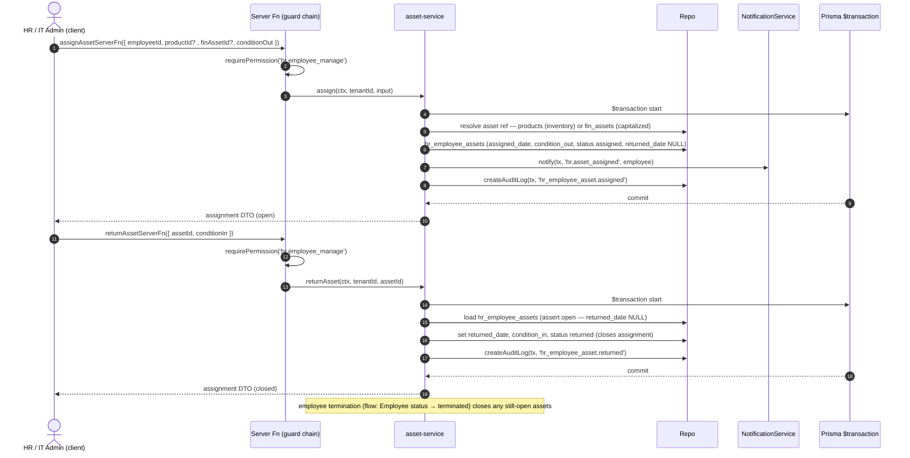

# Sequence Diagrams — HR / HCM (Spec 007)

End-to-end flows through the canonical layering documented in `CLAUDE.md`:

```
Client → server function (guard chain) → service ($transaction) → repo
                                        ↘ ApprovalEngine (pod_approval_*)
                                        ↘ FinancePosting (postJournalEntry — Spec 006)
                                        ↘ NotificationService (notify) + AuditLog
```

**Guard chain** (every tenant-scoped HR server function, FR-SEC — the only
tenant-isolation boundary; a missing guard leaks cross-tenant data):

```
getCurrentUserContext({ accessToken, tenantId })
  → requireAuth(context)
  → requireTenantAccess(context, tenantId)
  → requirePermission(context, '<hr.*>')
```

**Invariants shown throughout:**

- HR **never writes `fin_journal_*` directly** — money reaches the GL only
  through `postJournalEntry(tx, { sourceDocType, sourceDocId, … })`, which is
  idempotent on `(sourceDocType, sourceDocId)` (a re-post is a no-op).
- `hr_employee_history` is **append-only**; the Employee service is its only
  writer, one effective-dated row per changed tracked field.
- Approvals are delegated to the shared `pod_approval_*` engine via
  `openApprovalRequest` / `actOnApproval`; notifications via `notify(tx, …)`.

---

## 1. Recruitment → Hire

Requisition → application → interview + feedback → offer → acceptance →
`HrEmployee` creation with an initial `hr_employee_history` `'hired'` row.

```mermaid
sequenceDiagram
    autonumber
    actor U as Recruiter (client)
    participant SF as Server Fn (guard chain)
    participant RS as recruitment-service
    participant AE as ApprovalEngine
    participant ES as employee-service
    participant R as Repo
    participant N as NotificationService
    participant DB as Prisma $transaction

    U->>SF: createJobOpeningServerFn({ requisition })
    SF->>SF: requirePermission('hr.recruitment_manage')
    SF->>RS: createOpening(ctx, tenantId, input)
    RS->>AE: openApprovalRequest(entity_type 'hr_job_opening')
    AE->>R: pod_approval_requests (pending); opening holds at draft
    Note over R: on approval → hr_job_openings status_code=open

    U->>SF: applyCandidateServerFn({ jobOpeningId, candidate })
    SF->>RS: addCandidate(...) → hr_candidates (stage applied)
    U->>SF: scheduleInterviewServerFn({ candidateId, round })
    SF->>RS: hr_interviews (scheduled); candidate stage → interview
    U->>SF: submitFeedbackServerFn({ interviewId, scores })
    SF->>RS: hr_interview_feedback (overall_score, recommendation)

    U->>SF: extendOfferServerFn({ candidateId })
    SF->>RS: createOffer(...) → hr_job_offers (offered_salary, position, grade)
    RS->>AE: openApprovalRequest(entity_type 'hr_job_offer')
    AE->>R: offer approved → candidate stage → offer

    U->>SF: recordOfferResponseServerFn({ offerId, decision:'accepted' })
    SF->>RS: acceptOffer(ctx, offerId)
    RS->>DB: $transaction start
    RS->>R: hr_offer_acceptance (decision accepted, responded_at)
    RS->>ES: createEmployeeFromOffer(tx, offer)
    ES->>R: hr_employees (employee_code, probation, contract, salary components)
    ES->>R: appendEmployeeHistory(tx, changeType='hired', effective=hire_date)
    RS->>R: hr_candidates stage_code=hired
    RS->>N: notify(tx, 'hr.candidate_hired', hiring_manager)
    RS->>R: createAuditLog(tx, 'hr_employee.created')
    DB-->>RS: commit
    RS-->>U: { employeeId, employeeCode, onboarding checklist }
```

---

## 2. Leave Request Approval

Employee submits → guard chain → `openApprovalRequest` → two-step ladder
(manager then HR `actOnApproval`) → balance deducted **only** at final approval,
in the approving transaction.

```mermaid
sequenceDiagram
    autonumber
    actor E as Employee (client)
    actor M as Manager
    actor H as HR Officer
    participant SF as Server Fn (guard chain)
    participant LS as leave-service
    participant AE as ApprovalEngine
    participant R as Repo
    participant N as NotificationService
    participant DB as Prisma $transaction

    E->>SF: submitLeaveRequestServerFn({ leaveTypeId, dates })
    SF->>SF: getCurrentUserContext → requireTenantAccess → requirePermission('hr.leave_request')
    SF->>LS: submit(ctx, tenantId, input)
    LS->>DB: $transaction start
    LS->>R: hr_leave_requests (status submitted, total_days)
    LS->>R: hr_leave_balances pending_days += total_days (NOT deducted yet)
    LS->>AE: openApprovalRequest(tx, entity_type 'hr_leave_request', amount=total_days)
    AE->>R: pod_approval_requests (pending, step 1 → manager)
    LS->>N: notify(tx, 'hr.leave_submitted', manager)
    DB-->>LS: commit
    LS-->>E: request DTO (submitted)

    M->>SF: actOnLeaveApprovalServerFn({ requestId, decision:'approve' })
    SF->>SF: requirePermission('hr.leave_approve')
    SF->>AE: actOnApproval(tx, step 1 approve)
    AE->>R: hr_leave_approvals (step_order 1, decided); status manager_approved
    AE->>R: advance pod_approval_requests → step 2 (HR)
    AE->>N: notify(tx, 'hr.leave_manager_approved', hr_officer)

    H->>SF: actOnLeaveApprovalServerFn({ requestId, decision:'approve' })
    SF->>SF: requirePermission('hr.leave_approve')
    SF->>LS: finalizeApproval(ctx, requestId)
    LS->>DB: $transaction start
    LS->>AE: actOnApproval(tx, final step approve)
    AE->>R: hr_leave_approvals (step_order 2, decided); status approved
    LS->>R: hr_leave_balances used_days += total_days, pending_days -= total_days, balance_days recomputed
    LS->>N: notify(tx, 'hr.leave_approved', employee)
    LS->>R: createAuditLog(tx, 'hr_leave_request.approved')
    DB-->>LS: commit
    LS-->>H: request DTO (approved, balance debited)
```

---

## 3. Payroll Run

Gather inputs → calculate details → approve → post to finance (idempotent) →
mark paid. HR calls `postJournalEntry` with `sourceDocType='hr_payroll_run'`.

```mermaid
sequenceDiagram
    autonumber
    actor P as Payroll Officer (client)
    actor A as Approver
    participant SF as Server Fn (guard chain)
    participant PS as payroll-service
    participant R as Repo
    participant AE as ApprovalEngine
    participant FP as FinancePosting (postJournalEntry)
    participant DB as Prisma $transaction

    P->>SF: calculatePayrollRunServerFn({ periodId })
    SF->>SF: requirePermission('hr.payroll_run')
    SF->>PS: calculate(ctx, tenantId, periodId)
    PS->>R: gather hr_employee_contracts + hr_employee_salary_components
    PS->>R: gather hr_attendance_daily (worked/overtime) + hr_leave_requests (unpaid)
    PS->>R: gather hr_overtime_requests, hr_employee_benefits
    PS->>R: gather hr_loan_installments + hr_salary_advances due this period
    PS->>DB: $transaction — write hr_payroll_details + hr_payroll_component_details
    Note over PS: gross − deductions = net per employee; rounding residue → configured account
    PS->>R: hr_payroll_runs totals; status calculated
    PS-->>P: run DTO (calculated, totals)

    P->>SF: submitPayrollRunServerFn({ id })
    SF->>AE: openApprovalRequest(entity_type 'hr_payroll_run', amount=total_net)
    AE->>R: pod_approval_requests (pending); run holds at calculated
    A->>AE: actOnApproval(approve final)
    AE->>R: hr_payroll_runs status approved

    P->>SF: postPayrollRunServerFn({ id })
    SF->>SF: requirePermission('hr.payroll_post')
    SF->>PS: post(ctx, tenantId, id)
    PS->>DB: $transaction start; assert status approved and not already posted
    PS->>FP: postJournalEntry(tx, { sourceDocType:'hr_payroll_run', sourceDocId:id, lines })
    Note over FP: idempotent on (sourceDocType, sourceDocId) — re-post = no-op<br/>Dr salary + employer contributions, Cr net-pay / statutory / loan / advance
    FP-->>PS: journalEntryId
    PS->>R: hr_payroll_runs journal_entry_id, is_posted=true, status posted (immutable)
    PS->>R: createAuditLog(tx, 'hr_payroll_run.posted')
    DB-->>PS: commit

    P->>SF: markPayrollPaidServerFn({ id })
    SF->>PS: markPaid(...) → hr_payroll_details payment_status, run status paid
    PS-->>P: run DTO (paid)
```

---

## 4. Employee Update with Append-only History

Every tracked-field change (grade / position / salary / manager) appends an
effective-dated `hr_employee_history` row in the same `$transaction` as the
update — the Employee service is the sole history writer.

```mermaid
sequenceDiagram
    autonumber
    actor U as HR Officer (client)
    participant SF as Server Fn (guard chain)
    participant ES as employee-service
    participant R as Repo
    participant DB as Prisma $transaction

    U->>SF: updateEmployeeServerFn({ employeeId, patch })
    SF->>SF: getCurrentUserContext → requireTenantAccess → requirePermission('hr.employee_manage')
    SF->>SF: validate patch with Zod (.inputValidator)
    SF->>ES: updateEmployee(ctx, tenantId, employeeId, patch)
    ES->>DB: $transaction start
    ES->>R: load current hr_employees row (FOR UPDATE)
    ES->>ES: diff patch vs current → tracked changes (grade, position, salary, manager, status)
    ES->>R: updateEmployee(tx, employeeId, patch)
    loop each changed tracked field
        ES->>R: appendEmployeeHistory(tx, { changeType, field_name, old_value, new_value, effective_date, changed_by })
        Note over R: append-only — no update / no delete path; overwrite attempt rejected
    end
    ES->>R: createAuditLog(tx, 'hr_employee.updated', diff)
    DB-->>ES: commit
    ES-->>U: employee DTO (+ new history rows)
```

---

## 5. Expense Claim → Reimbursement → Finance Posting

Submit → approve → reimburse → post through `postJournalEntry`
(`sourceDocType='hr_expense_claim'`).

```mermaid
sequenceDiagram
    autonumber
    actor E as Employee (client)
    actor A as Approver
    participant SF as Server Fn (guard chain)
    participant XS as expense-service
    participant AE as ApprovalEngine
    participant R as Repo
    participant FP as FinancePosting (postJournalEntry)
    participant N as NotificationService
    participant DB as Prisma $transaction

    E->>SF: submitExpenseClaimServerFn({ lines, travelRequestId? })
    SF->>SF: requirePermission('hr.expense_manage')
    SF->>XS: submit(ctx, tenantId, input)
    XS->>R: hr_expense_claims + hr_expense_claim_lines (status submitted, total_amount)
    XS->>AE: openApprovalRequest(entity_type 'hr_expense_claim', amount=total_amount)
    AE->>R: pod_approval_requests (pending)
    XS->>N: notify(tx, 'hr.expense_submitted', approver)
    XS-->>E: claim DTO (submitted)

    A->>SF: actOnExpenseApprovalServerFn({ claimId, decision:'approve', approvedAmount })
    SF->>SF: requirePermission('hr.expense_approve')
    SF->>AE: actOnApproval(approve)
    AE->>R: hr_expense_claims status approved, approved_amount set

    A->>SF: reimburseExpenseClaimServerFn({ claimId, method })
    SF->>XS: reimburse(ctx, tenantId, claimId, method)
    XS->>DB: $transaction start
    alt reimburse via payroll
        XS->>R: hr_expense_reimbursements (payroll_run_id set — paid next run)
    else direct payment
        XS->>R: hr_expense_reimbursements (payment_method, bank_account_id)
    end
    XS->>R: hr_expense_claims status reimbursed
    XS->>FP: postJournalEntry(tx, { sourceDocType:'hr_expense_claim', sourceDocId:claimId, lines })
    Note over FP: Dr expense by line category (cost_center_id), Cr net-pay or AP liability; idempotent
    FP-->>XS: journalEntryId
    XS->>R: hr_expense_claims journal_entry_id, status posted
    XS->>R: createAuditLog(tx, 'hr_expense_claim.posted')
    DB-->>XS: commit
    XS-->>A: claim DTO (posted)
```

---

## 6. Asset Assignment

Assign an inventory `product_id` or a capitalized `fin_asset_id` to an
employee (`hr_employee_assets`); the **return** edge closes the open assignment.


