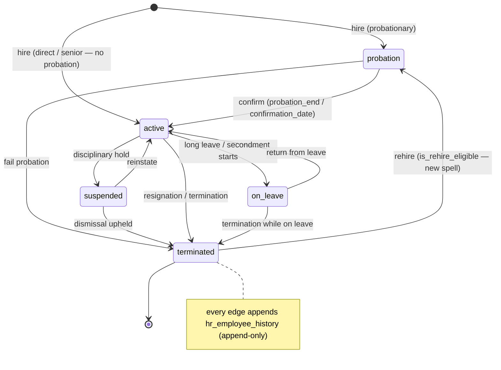
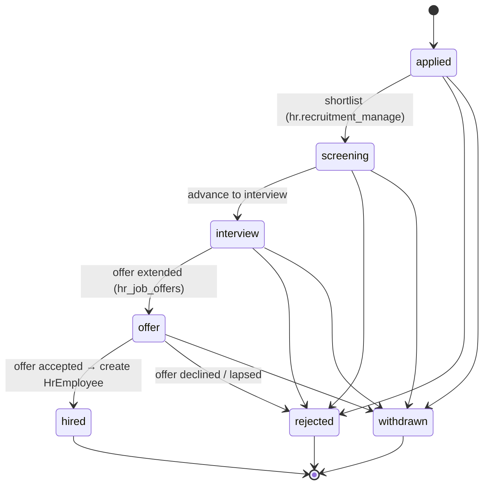
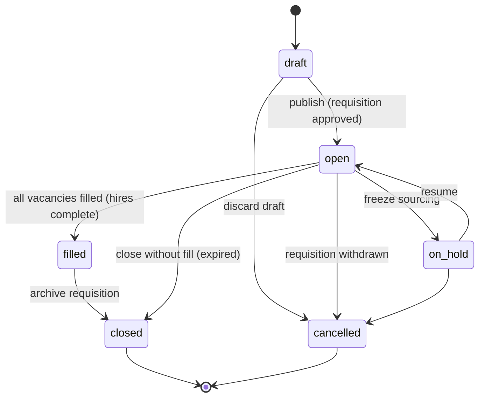
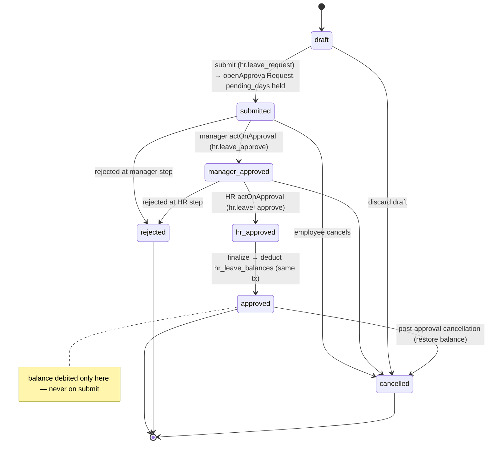
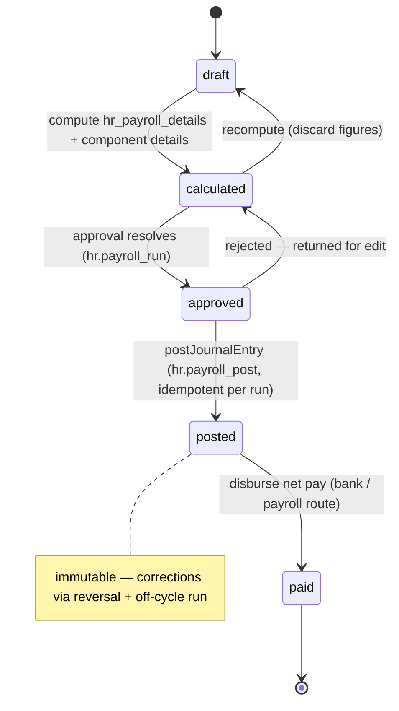
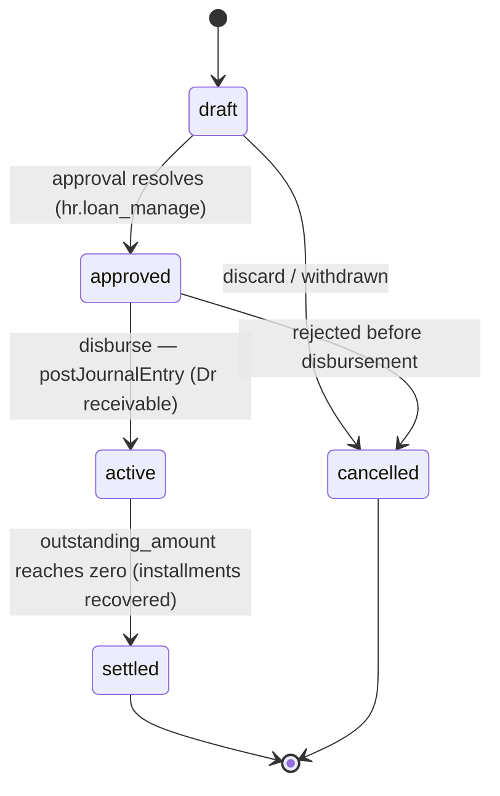
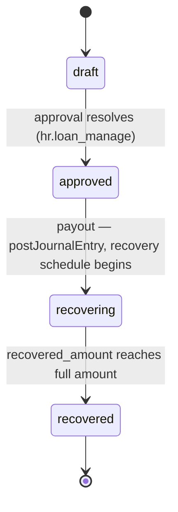
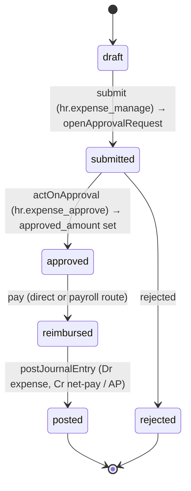
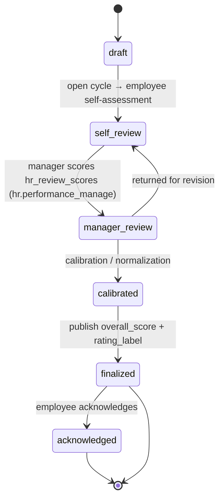
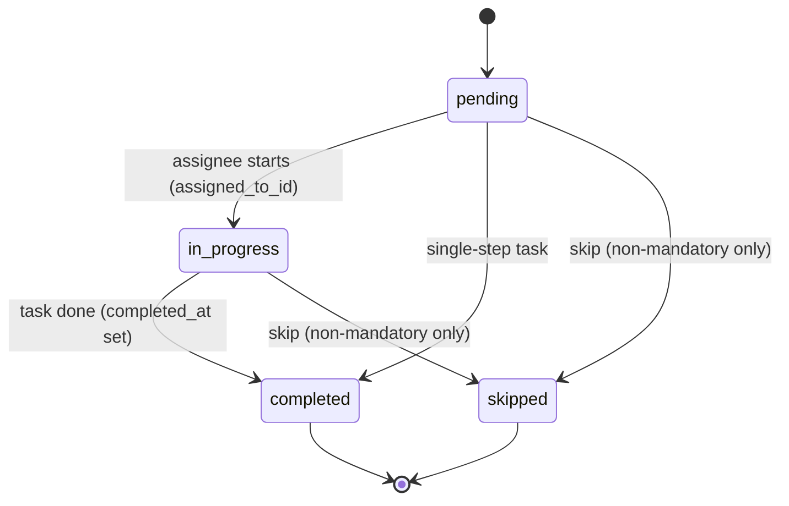

# State Diagrams — HR / HCM (Spec 007)

Lifecycle diagrams for every stateful `hr_` document. As in the 006 module, HR
uses the **lookup-table status regime**: free-string `status_code` /
`stage_code` / `employment_status` columns validated against the shared
`pod_document_statuses` registry with legal edges in `pod_status_transitions`
— **no new Prisma enums**. A `NULL`-tenant status row is the global default;
a tenant may extend a lifecycle without a code change, and a
`requires_permission` transition row gates an edge (e.g. only `hr.payroll_post`
may post a run, only `hr.leave_approve` may approve a leave request).

Append-only rows carry **no status** — `hr_employee_history`,
posted `hr_payroll_details` / `hr_payroll_component_details`, and
`hr_goal_progress` exist or they don't; corrections are new rows or reversals.
Every transition that touches the general ledger does so through the Spec 006
`postJournalEntry` engine — HR never writes `fin_journal_*` directly, and a
posted document is immutable (correction = reversal).

---

## Employee — `hr_employees.employment_status`

Initial: `probation` (or `active` for a direct/senior hire). Terminal:
`terminated`. `on_leave` and `suspended` are reversible operational states that
return to `active`. Every edge appends an effective-dated `hr_employee_history`
row (BR-EMP-02) in the same transaction. A terminated employee flagged
`is_rehire_eligible` can be brought back through the **rehire** edge, which
starts a fresh employment spell (new contract, new history row).

---

## Candidate — `hr_candidates.stage_code`

Initial: `applied`. Terminal: `hired`, `rejected`, `withdrawn`. The stage
ladder advances one step at a time (`screening → interview → offer`); a
candidate may be `rejected` from any active stage, or self-`withdrawn`.
`hired` is only reachable once an offer is accepted
(`hr_offer_acceptance.decision = accepted`) and triggers `HrEmployee` creation.

---

## Job Opening — `hr_job_openings.status_code`

Initial: `draft`. Terminal: `closed`, `cancelled`. A requisition opens only
after its `approval_request_id` resolves approved. `on_hold` freezes sourcing
without losing the pipeline; `filled` is reached when vacancies are met, then
`closed` archives it. Cancellation is available before it is filled.

---

## Leave Request — `hr_leave_requests.status_code`

Initial: `draft`. Terminal: `approved`, `rejected`, `cancelled`. Submission
raises an `openApprovalRequest`; the request climbs a two-step ladder
(`manager_approved → hr_approved`) recorded in `hr_leave_approvals`, and only
the final `approved` transition **debits `hr_leave_balances`** — in the same
transaction as the last `actOnApproval` (FR-LEA). Rejection at any step, or
employee cancellation before final approval, releases the pending days.

---

## Payroll Run — `hr_payroll_runs.status_code`

Initial: `draft`. Terminal: `paid`. `calculated` writes
`hr_payroll_details` + `hr_payroll_component_details`; recompute is allowed only
while `draft`/`calculated`. `approved` locks the figures (via
`openApprovalRequest` on `hr_payroll_run`). `posted` calls `postJournalEntry`
(`sourceDocType='hr_payroll_run'`, idempotent per run id) and is **immutable** —
no edit, no re-post; corrections happen through a reversal + off-cycle run.
`paid` marks disbursement of the net amounts.

---

## Loan — `hr_loans.status_code`

Initial: `draft`. Terminal: `settled`, `cancelled`. Approval routes through
`openApprovalRequest` (`hr_loan`). `active` is reached on **disbursement**,
which posts through `postJournalEntry` (Dr loan receivable, Cr net-pay/bank);
installments then recover against successive payroll runs
(`hr_loan_installments.payroll_run_id`) until the outstanding amount hits zero
→ `settled`. A loan may be `cancelled` before disbursement.

---

## Salary Advance — `hr_salary_advances.status_code`

Initial: `draft`. Terminal: `recovered`. Approval via `openApprovalRequest`;
payout posts through `postJournalEntry`. `recovering` deducts a slice each
payroll run over `recovery_months` until `recovered_amount = amount` →
`recovered`.

---

## Expense Claim — `hr_expense_claims.status_code`

Initial: `draft`. Terminal: `posted`, `rejected`. Submission routes through
`openApprovalRequest` (`hr_expense_claim`). `approved` sets `approved_amount`;
`reimbursed` disburses (direct payment or via a payroll run); `posted` records
the accounting through `postJournalEntry` (Dr expense by line category, Cr
net-pay or AP liability). Rejection is terminal from the submitted state.

---

## Performance Review — `hr_performance_reviews.status_code`

Initial: `draft`. Terminal: `finalized` (with an optional `acknowledged`
follow-up by the employee). The cycle moves through `self_review` (employee),
`manager_review` (reviewer scores `hr_review_scores`), `calibrated`
(cross-team normalization), then `finalized` — which may append an
`hr_employee_history` row if the outcome drives a grade/salary action.
`acknowledged` records the employee sign-off on the finalized result.

---

## Onboarding Task — `hr_employee_onboarding.status_code`

Per-task instance materialized from an `hr_onboarding_templates` /
`hr_onboarding_tasks` checklist. Initial: `pending`. Terminal: `completed`,
`skipped`. `skipped` is only permitted for non-mandatory tasks
(`hr_onboarding_tasks.is_mandatory = false`); mandatory tasks must reach
`completed`.

